# Squad Up

## Full stack website

**Built using**:\
REACT, Django Python, JavaScript, BootStrap, CSS and HTML.

**Also including**:\
Cloudinary.


## Live site

[Hosted on Heroku](https://squadup-frontend.herokuapp.com/)

## Repository

- [GitHub repository - FRONTEND](https://github.com/BobWritesCode/squadup_frontend)
- [GitHub repository - BACKEND](https://github.com/BobWritesCode/SquadUp_api)

## Table of Contents

- [Squad Up](#squad-up)
  - [Live site](#live-site)
  - [Repository](#repository)
  - [Table of contents](#table-of-contents)
  - [Objective](#objective)
  - [Brief](#brief)
    - [Squad Up - Team builder website](#squad-up---team-builder-website)
  - [UX - User Experience Design](#ux---user-experience-design)
    - [Site-visitor](#site-visitor)
    - [Server-owner](#server-owner)
    - [Site-admin](#site-admin)
  - [Development](#development)
    - [Agile design](#agile-design)
      - [GitHub issues](#github-issues)
        - [Issue numbers](#issue-numbers)
        - [User story](#user-story)
        - [Bug report](#bug-report)
        - [Feature request](#feature-request)
        - [Improvement request](#improvement-request)
        - [Assign an assignee or assignees](#choose-assignees)
        - [Apply labels](#choose-labels)
        - [Choose the project](#choose-project)
        - [Choose the milestone](#choose-milestone)
      - [Kanban board](#kanban-board)
    - [Wireframes](#wireframes)
      - [Homepage design](#homepage-design)
      - [Squad Finder design](#listings-design)
      - [Profile design](#full-listing-design)
    - [Colour scheme](#colour-scheme)
    - [Typography](#typography)
    - [Imagery](#imagery)
  - [Features](#features)
    - [Existing features](#existing-features)
      - [Navbar](#navbar)
      - [Homepage](#homepage)
      - [Profile](#profile)
        - [Profile Box](#profile-box)
        - [User notes](#user-notes)
        - [Posts](#posts)
      - [Squad Finder](#squad-finger)
          - [Create group](#create-group)
            - [Create slot](#create-slot)
          - [Review applications](#review-applications)
          - [Find Group](#find-group)
            -[Request to join](#request-to-join)
          - [Review my requests](#review-my-requests)
            - [Delete request](#delete-requests)
      - [User authentication](#user-authentication)
        - [Sign up](#sign-up)
        - [Login](#login)
        - [Change password](#forgotten-password)
    - [Features left to implement](#features-left-to-implement)
  - [Technologies used](#technologies-used)
    - [Logic](#logic)
      - [Data model](#data-model)
      - [Django](#django)
      - [Python](#python)
        - [Python packages](#python-packages)
      - [JavaScript](#javascript)
        - [REACT](#jquery)
      - [CSS](#css)
        - [BootStrap](#bootstrap)
    - [Widgets](#widgets)
      - [Cloudinary](#cloudinary)
  - [Testing](#testing)
    - [HTML](#html-testing)
    - [CSS](#css-testing)
    - [JavaScript](#javascript-testing)
    - [Python](#python-testing)
      - [Linters](#python-linters)
      - [Unit testing](#unit-testing)
      - [Coverage](#coverage)
    - [User testing](#user-testing)
  - [Bugs](#bugs)
    - [Unresolved](#unresolved)
    - [Resolved](#resolved)
  - [Deployment](#development)
    - [GitHub - Cloning](#github---cloning)
    - [Cloudinary deployment](#cloudinary-deployment)
    - [Neon deployment](#neon)
    - [Heroku](#hero)
  - [Credits](#credits)
    - [VS Code extensions](#vs-code-extensions)
    - [Other tech](#other-tech)
    - [Content](#content)
    - [Acknowledgements](#acknowledgements)

---

## Objective

Design an interactive Full-Stack application using HTML, CSS and advanced JavaScript. The application will include a front-end repository and a backend repository.

Main technologies that need to be used:
HTML, CSS, JavaScript (React),Python (Django) and a relational database (recommending MySQL or Postgres).

[🔝](#table-of-contents)

---

## Brief

### Squad Up - Team builder website

The goals of this applications are:

- to provide a hub were players can build a team.
- group leaders will be able to create a team listing looking for players.
- searching players will be able to search for a group by using filters.

[🔝](#table-of-contents)

---

## UX - User Experience Design

### New user

> *"As a new user I can register so that I can access registered user functions."*

### Registered user

> *"As a registered user I can login so that I can access logged in user functions."*
>
> *"As a logged in user I can manage my profile so that I can make sure it reflects me accurately."*
>
> *"As a logged in user I can create a post that appears in my profile so that other users can view the post."*
>
> *"As a logged in user I can leave private notes of a player's profile so that next time I come across them, I have a way to remember their behaviors'."*

### Registered user - Team leader

> *"As a logged in user I can create a looking for group listing so that other users looking for a group can request to join my group."*
>
> *"As a looking for group owner I can review requests to join my group by accept or declining the request so that the requester will know if they are successful."*
>
> *"As a looking for group owner I can kick a player from the group so that if they do not respond after joining, I can free the slot back up."*

### Registered user - Team Recruit

> *"As a user who has joined a group I can leave the group so that the slot is made available and I can join a different group."*
>
> *"As a logged in user I can request to join a group that is looking for a teammate so that they can review my profile and decided if to accept or reject me."*

[🔝](#table-of-contents)

---

## Development

### Agile design

- [GitHub Issues](#github-issues)
  - [Issue numbers](#issue-numbers)
  - [User Story](#user-story)
  - [Bug Report](#bug-report)
  - [Feature Request](#feature-request)
  - [Improvement Request](#improvement-request)
  - [Assign an assignee or assignees](#choose-assignees)
  - [Apply labels](#choose-labels)
  - [Choose the project](#choose-project)
  - [Choose the milestone](#choose-milestone)
- [Kanban Board](#kanban-board)

When taking on any application especially large and complicated application with different moving parts, where it's easy to jump from one part of the application to another, leaving the previous part incomplete and leaving room for error. It's best to come up with a strategy. This is where agile design comes in, it can help you identify all the different parts of the application that need to be completed, in which order may be best, and if you are in a team delegate tasks to people so everyone knows what their responsibilities are.

As part of the application, I heavily used GitHub Issues and GitHub Kanban board.

### GitHub issues

I created 4 different templates for issues being raised:

- [User story](#user-story)
- [Bug report](#bug-report)
- [Feature request](#feature-request)
- [Improvement request](#improvement-request)

Each issue category played a part in helping easily identify the category the issue was going to be related to, and each has a different template for myself, and other users to provide useful information that will help resolve the issue.

When an issue is either being created or after. There are a few different options you can modify to help delegate the task and its priority. You can:

- [Assign an assignee or assignees](#choose-assignees)
- [Apply labels](#choose-labels)
- [Choose the project](#choose-project)
- [Choose the milestone](#choose-milestone)

[🔝](#table-of-contents)

### Issue numbers

Every issue raised will have an issue number i.e., #1, #2, #3 and so on. If you put the issue number in the commit message, then that commit will automatically by GitHub be linked to that issue.

If you use certain keywords as well it will also automatically manage the issue such as 'bug: fixes #58'. This will automatically close that issue for you.

### User story

[Link to user story template.](https://github.com/BobWritesCode/squadup_frontend/blob/master/.github/ISSUE_TEMPLATE/user-story.md)

[Link to user story Issues.](https://github.com/users/BobWritesCode/projects/5/views/2?filterQuery=USER+STORY)

The user story was the first template I created, and this was basically to help start to build the idea of the application and what potential features were going to be needed.

Any user story was also allocated the tag 'new feature' automatically to help identify this was going to be a new feature.

### Bug report

[Link to bug report template.](https://github.com/BobWritesCode/squadup_frontend/blob/master/.github/ISSUE_TEMPLATE/bug_report.md)

[Link to bug report Issues.](https://github.com/users/BobWritesCode/projects/5/views/2?filterQuery=label%3Abug+)

As large and complex application, inevitably bugs came up. Bugs are very easy to get distracted by as they generally are discovered while working on an unrelated feature. When a bug comes up, I create a bug report so I can attend to it later.

Bug reports are allocated the tag 'bug' to help identify them. You can also opt to allocate it the tag 'priority' to show it is something that needs to be fixed immediately as it could be application breaking or may affect many users.

### Feature request

[Link to feature request template.](https://github.com/BobWritesCode/squadup_frontend/blob/master/.github/ISSUE_TEMPLATE/new-feature.md)

[Link to feature request Issues.](https://github.com/users/BobWritesCode/projects/5/views/2?filterQuery=label%3A%22new+feature%22)

While building the application new ideas on new features would come to mind. Some that would potentially be perfect for the first version of the application and some that potentially could be implemented later. Whenever a new feature came to mind, I would complete the feature request form.

Any feature request was also allocated the tag 'new feature' automatically to help identify this was going to be a new feature.

### Improvement request

[Link to improvement request template.](https://github.com/BobWritesCode/squadup_frontend/blob/master/.github/ISSUE_TEMPLATE/improvement.md)

[Link to improvement request Issues.](https://github.com/users/BobWritesCode/projects/5/views/2?filterQuery=label%3Aimprovement)

Either while using the application as a user or developing the application. I would realise improvements to feature that had already been built. To separate new features to improvements I created the Improvement Request form. Improvements could mainly be left to later in the application as it was important to make sure that all the main features were implemented first.

Any improvement Request was also allocated the tag 'improvement' automatically to help identify this was going to be a new feature.

### Choose assignees

[Link to my assigned issues.](https://github.com/users/BobWritesCode/projects/5/views/2?filterQuery=assignee%3ABobWritesCode)

It may come as no surprise; I am the only person assigned issues on this project. Potentially in the future if the project grows and the team grows past me, then I would be able to assign other team members to tasks.

### Choose labels

[Link to Frontend label choices for this application.](https://github.com/BobWritesCode/squadup_frontend/labels)\
[Link to Backend label choices for this application.](https://github.com/BobWritesCode/squadup_api/labels)

When creating an issue from an issue report, a label is automatically allocated but the user or a person creating the issue can choose to assign labels from the option available. For example, if something needs to be tagged as 'priority'.

### Choose Project

It's probably obvious but all issues were assigned to this project. If you have one repository being used for several projects, it is useful to be able to choose the correct project.

### Choose milestone

[Link to Frontend milestones for this application.](https://github.com/BobWritesCode/squadup_frontend/milestones)\
[Link to Backend milestones for this application.](https://github.com/BobWritesCode/squadup_api/milestones)

A milestone is essentially a marker in the applications journey i.e., Alpha, Beta, Release v1, v2 and so on... For a large application where development may be over a long period, such as a year. You may decide to allocate features to different quarters of the year. The milestone option allows you to do that. This essentially prioritizes which issues need to be dealt with by when.

In my application I created 3 milestones:

- Launch version 1.00
  - These are issues that 100% must be done ready for version 1.00.
- Non-essential for v1.00
  - These are issues that would be nice to have done but are mandatory.
- Post v1.00
  - These are issues that are mainly going to be features that can wait until version 1.00 has been completed and be implements into a future version.

### Kanban board

[Link to application Kanban board.](https://github.com/users/BobWritesCode/projects/5)

A Kanban board is an agile application management tool that helps visualize tasks. It helps with the day-to-day works flow as you can easily see which tasks need to be completed. With GitHub applications you can have several views of the Kanban board. As you might want to have one for the team, and maybe views for each team member. Or different labels such as bugs or improvements.

[🔝](#table-of-contents)

---

### Wireframes

Below are  wireframe that I designed to help build and represent the design of this application.

#### Homepage design

<details><summary>PC / Large screen</summary> <!-- markdownlint-disable-line -->

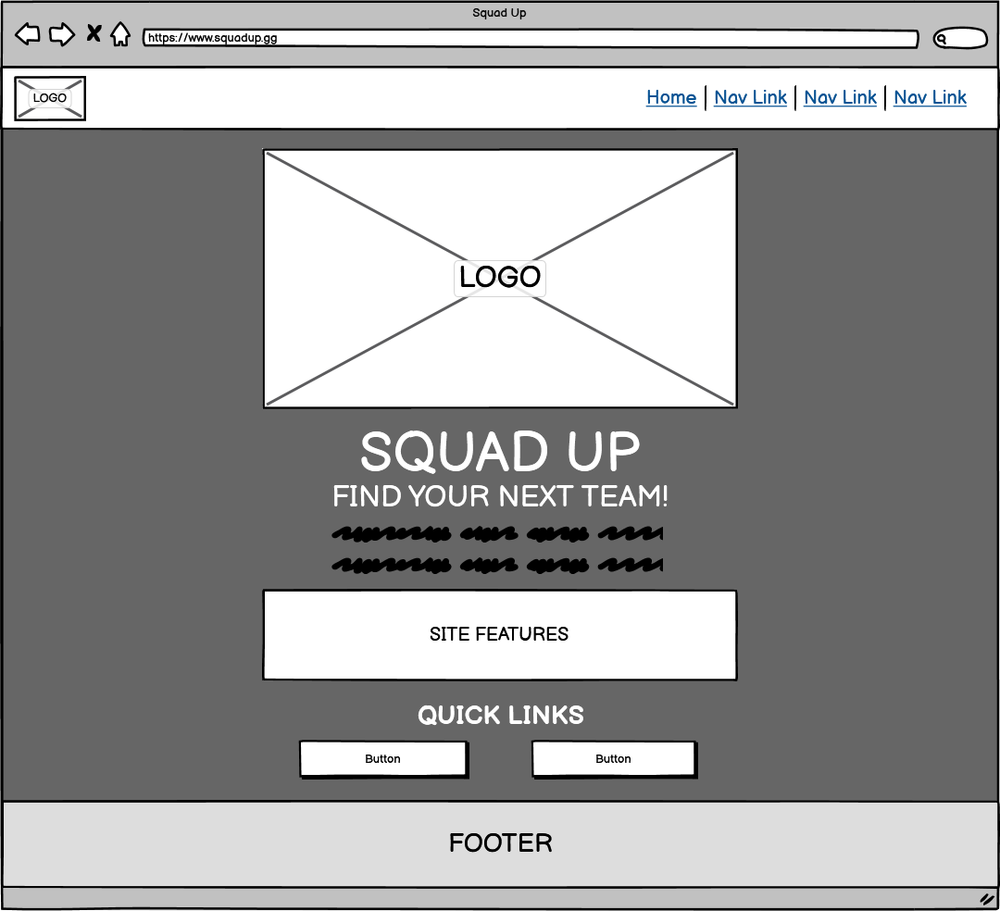
</details>

<details><summary>Mobile / Small screen</summary> <!-- markdownlint-disable-line -->

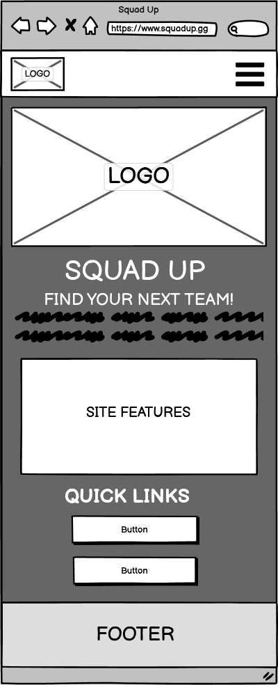
</details>

#### Sign in design

<details><summary>PC / Large screen</summary> <!-- markdownlint-disable-line -->

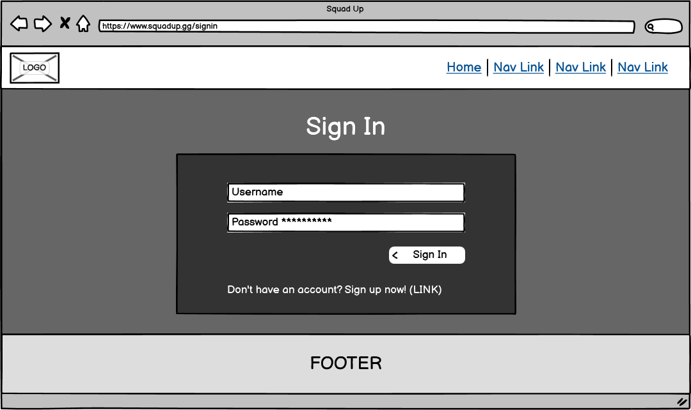
</details>

<details><summary>Mobile / Small screen</summary> <!-- markdownlint-disable-line -->

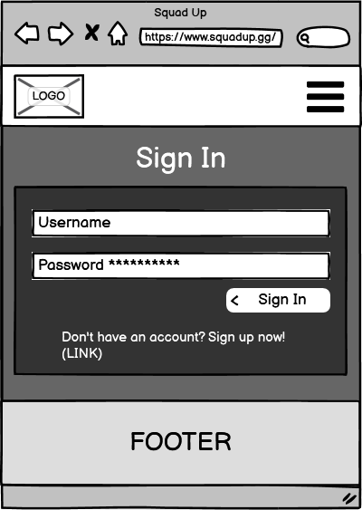
</details>

#### Registration design

<details><summary>PC / Large screen</summary> <!-- markdownlint-disable-line -->


</details>

<details><summary>Mobile / Small screen</summary> <!-- markdownlint-disable-line -->

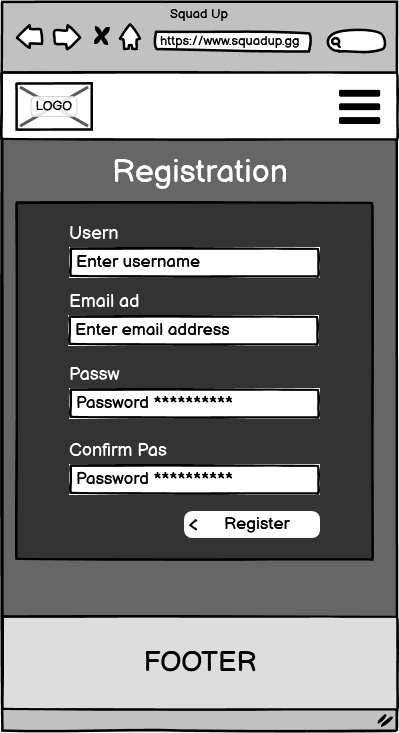
</details>

#### Profile design

<details><summary>PC / Large screen</summary> <!-- markdownlint-disable-line -->

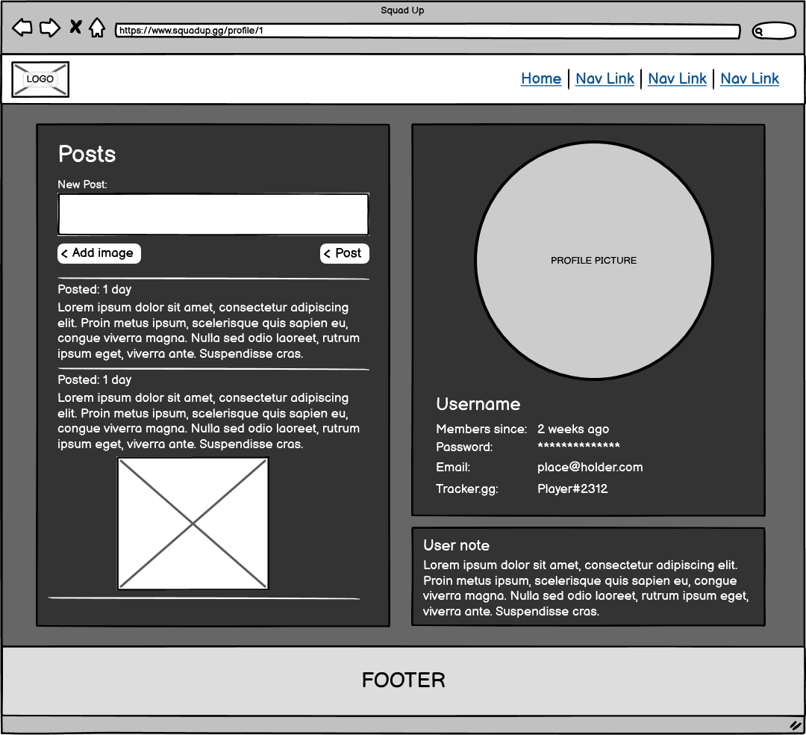
</details>

<details><summary>Mobile / Small screen</summary> <!-- markdownlint-disable-line -->

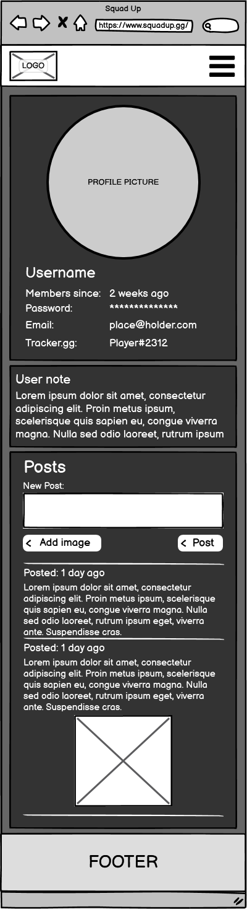
</details>

#### Squad Finder design

<details><summary>PC / Large screen</summary> <!-- markdownlint-disable-line -->

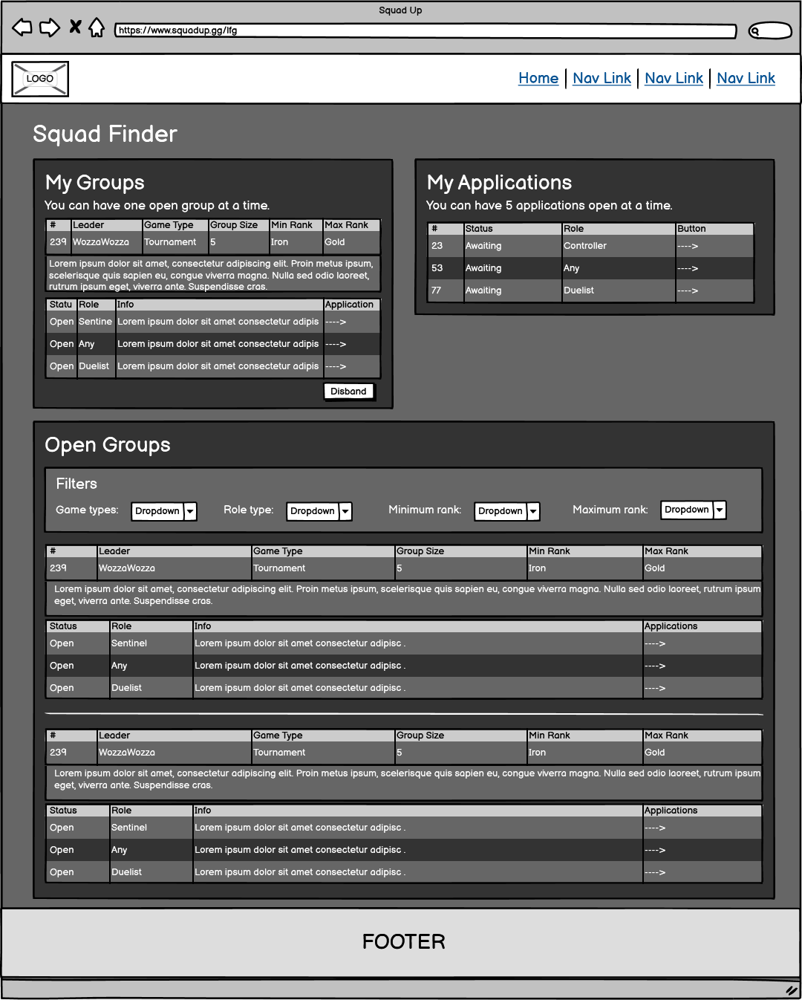
</details>

<details><summary>Mobile / Small screen</summary> <!-- markdownlint-disable-line -->

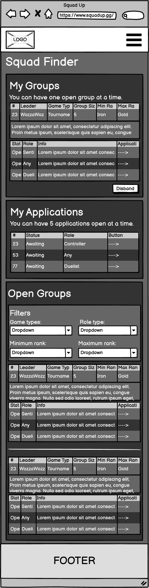
</details>

### Colour scheme

The 4 main colour's hex codes for this site are: B78F1D, 212731, 3F6974, FAFAFA.
These 4 colours contrast very nicely against each other, and the white text against the other 3 colours pass WCAG contrast scores.

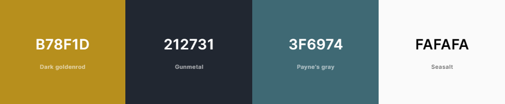

### Typography

We are using [BootStrap's](#bootstrap) native font stack. As it provides a sharp and clear font that works perfectly with the projects overall styling.

[Link to BootStrap's documentation for Native font stack.](https://getbootstrap.com/docs/5.3/content/reboot/#native-font-stack)

### Imagery

**This application comes with the following media:**

<details><summary>Squad Up logo - Variant 1</summary> <!-- markdownlint-disable-line -->

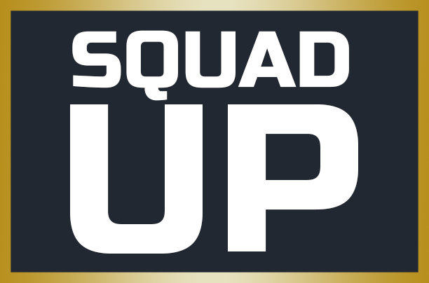
</details>

<details><summary>Squad Up logo - Variant 2</summary> <!-- markdownlint-disable-line -->


</details>

<details><summary>Squad Up logo - Variant 3</summary> <!-- markdownlint-disable-line -->


</details>

- This logo was created by myself. I tried to create a simplistic logo that could easily scaled and provided a premium look/feel.

<details><summary>Fav icon</summary> <!-- markdownlint-disable-line -->


</details>

- A miniature version of the Squad Up logo but with just the letter S. Making it easily identifiable in the browser.

Valorant rank badges.

- Use of these are covered within the [Riot 'Legal Jibber Jabber'](https://www.riotgames.com/en/legal).

**User uploaded images:**

The application allows users to upload images, currently there is no way to moderate these without accessing the SQL database. Future plans are to add an admin access area that will allow staff members moderate content on the application.

[🔝](#table-of-contents)

---

## Features


### Existing features

#### Navbar

[Navbar.js](https://github.com/BobWritesCode/squadup_frontend/blob/master/src/components/NavBar.js)

The Navbar is designed to contrast the rest of the page. This make it more easily identifiable oppose to blending in with the page which can be confusing once you start scrolling down the page, as the NavBar sticks to the top of the browser window

<details><summary>Navbar snapshot - PC</summary> <!-- markdownlint-disable-line -->

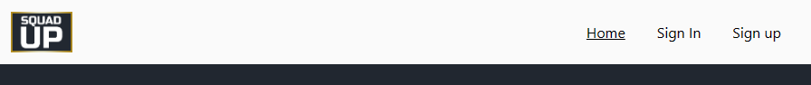

</details>

<details><summary>Navbar snapshot - Mobile - Closed</summary> <!-- markdownlint-disable-line -->


</details>

<details><summary>Navbar snapshot - Mobile - Open</summary> <!-- markdownlint-disable-line -->

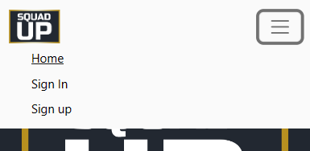

</details>

As you will see from the code below we use a [React Bootstrap Nav](https://react-bootstrap.github.io/components/navs/) component to create the applications' navigation bar.

``` js
<Navbar
  expanded={expanded}
  className={styles.NavBar}
  expand="md"
  fixed="top"
>
  <Container fluid>
    {/* Brand logo */}
    <Navbar.Brand>
      
    </Navbar.Brand>
    {/* Controls if nav is expanded or close for mobile */}
    <Navbar.Toggle
      aria-controls="navbarScroll"
      ref={ref}
      onClick={() => setExpanded(!expanded)}
    />
    <Navbar.Collapse id="navbarScroll">
      <Nav
        className="justify-content-end flex-grow-1 pe-3"
        style={{ maxHeight: '100px' }}
        navbarScroll
      >
        {/* Links to show depending in user is logged in or not */}
        {homeLink}
        {currentUser ? '' : signInLink}
        {currentUser ? '' : signUpLink}
        {currentUser ? lfgLink : ''}
        {currentUser ? profileLink : ''}
        {currentUser ? logoutLink : ''}
      </Nav>
    </Navbar.Collapse>
  </Container>
</Navbar>
```

#### Homepage

[HomePage.js](https://github.com/BobWritesCode/squadup_frontend/blob/master/src/pages/HomePage.js)

The homepage is designed to be simple and provide a clear understanding of what the website is about when a first-time user visits. It also provides some direction on what the user should do next if they are not logged in. If the user is logged in the 'Quick links' change.

<details><summary>Homepage - PC</summary> <!-- markdownlint-disable-line -->

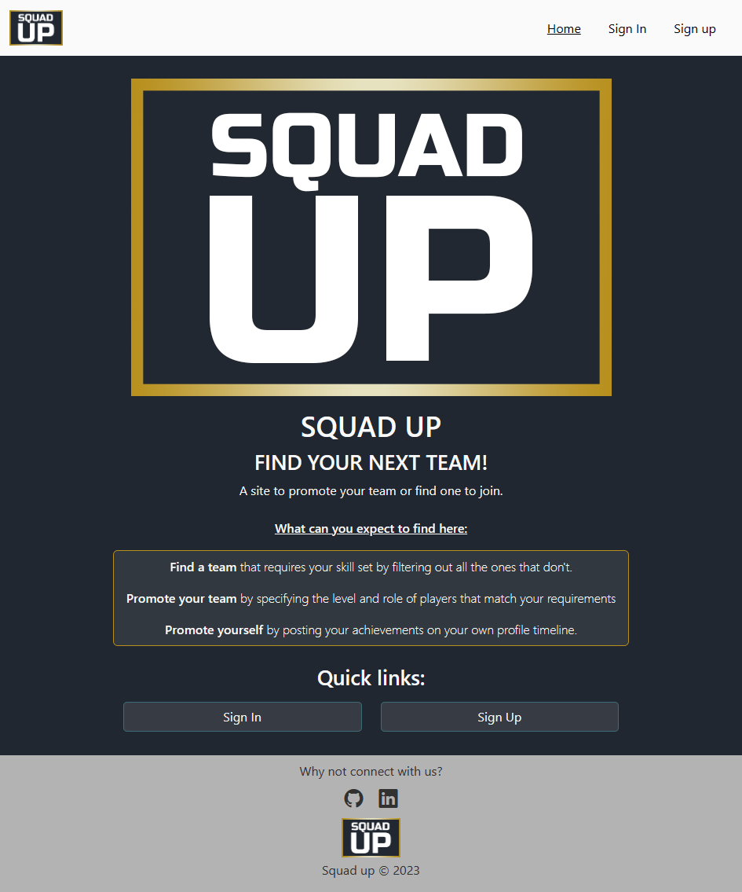

</details>

<details><summary>Homepage - Mobile</summary> <!-- markdownlint-disable-line -->

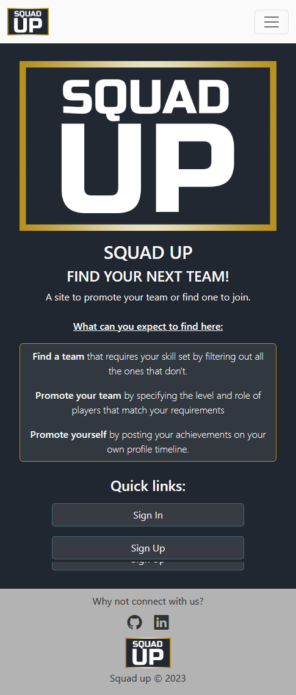

</details>

##### Sign up

<details><summary> - PC</summary> <!-- markdownlint-disable-line -->


</details>

<details><summary> - Mobile</summary> <!-- markdownlint-disable-line -->


</details>

##### Sign In

[SignInForm.js](https://github.com/BobWritesCode/squadup_frontend/blob/master/src/pages/auth/SignInForm.js)

The login screen as many of us would expect is a nice simple user form to input their username and password.

If the user cannot be found, or password does not match the correct account they will get an notifying them so.

<details><summary>Sign In - PC</summary> <!-- markdownlint-disable-line -->

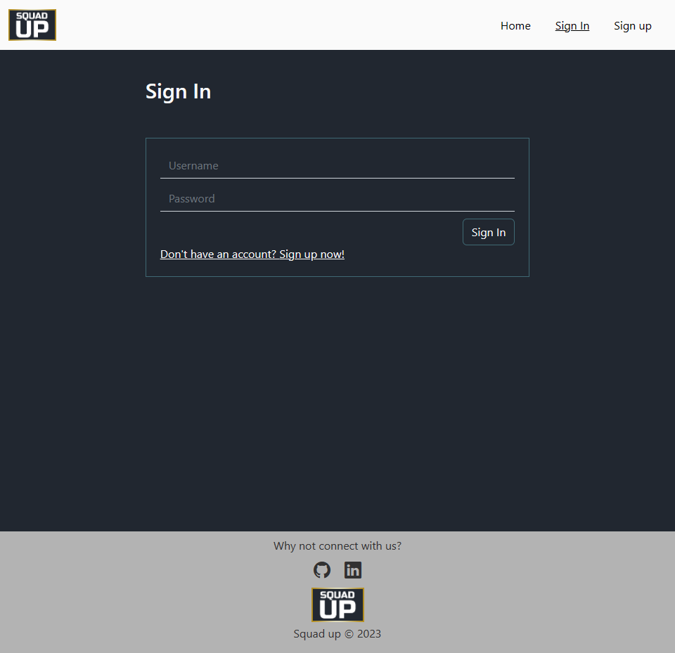

</details>

<details><summary>Sign In - Mobile</summary> <!-- markdownlint-disable-line -->

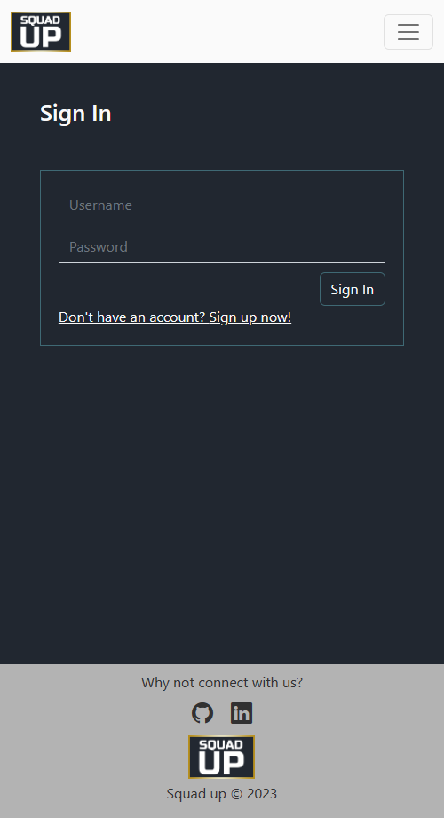

</details>

<details><summary>Sign In - Bad user credentials</summary> <!-- markdownlint-disable-line -->

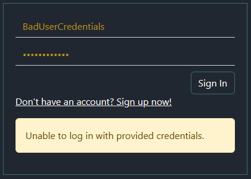

</details>

#### Profile

<details><summary>Profile - PC</summary> <!-- markdownlint-disable-line -->


</details>

<details><summary>Profile - Mobile</summary> <!-- markdownlint-disable-line -->


</details>

##### Profile Box

<details><summary> - PC</summary> <!-- markdownlint-disable-line -->


</details>

<details><summary> - Mobile</summary> <!-- markdownlint-disable-line -->


</details>

##### User notes

<details><summary> - PC</summary> <!-- markdownlint-disable-line -->


</details>

<details><summary> - Mobile</summary> <!-- markdownlint-disable-line -->


</details>

##### Posts

<details><summary> - PC</summary> <!-- markdownlint-disable-line -->


</details>

<details><summary> - Mobile</summary> <!-- markdownlint-disable-line -->


</details>

#### Squad Finder

<details><summary> - PC</summary> <!-- markdownlint-disable-line -->


</details>

<details><summary> - Mobile</summary> <!-- markdownlint-disable-line -->


</details>

##### Create group

<details><summary> - PC</summary> <!-- markdownlint-disable-line -->


</details>

<details><summary> - Mobile</summary> <!-- markdownlint-disable-line -->


</details>

##### Create slot

<details><summary> - PC</summary> <!-- markdownlint-disable-line -->


</details>

<details><summary> - Mobile</summary> <!-- markdownlint-disable-line -->


</details>

##### Review applications

<details><summary> - PC</summary> <!-- markdownlint-disable-line -->


</details>

<details><summary> - Mobile</summary> <!-- markdownlint-disable-line -->


</details>

##### Find Group

<details><summary> - PC</summary> <!-- markdownlint-disable-line -->


</details>

<details><summary> - Mobile</summary> <!-- markdownlint-disable-line -->


</details>

##### Request to join

<details><summary> - PC</summary> <!-- markdownlint-disable-line -->


</details>

<details><summary> - Mobile</summary> <!-- markdownlint-disable-line -->


</details>

##### Review my requests

<details><summary> - PC</summary> <!-- markdownlint-disable-line -->


</details>

<details><summary> - Mobile</summary> <!-- markdownlint-disable-line -->


</details>

##### Delete request

<details><summary> - PC</summary> <!-- markdownlint-disable-line -->


</details>

<details><summary> - Mobile</summary> <!-- markdownlint-disable-line -->


</details>

#### User authentication

<details><summary> - PC</summary> <!-- markdownlint-disable-line -->


</details>

<details><summary> - Mobile</summary> <!-- markdownlint-disable-line -->


</details>


##### Change password

<details><summary> - PC</summary> <!-- markdownlint-disable-line -->


</details>

<details><summary> - Mobile</summary> <!-- markdownlint-disable-line -->


</details>

### Features left to implement

- Admin area
- Close/Open group

[🔝](#table-of-contents)

---

## Technologies used

### Logic

#### Data model

The below entity relationship diagram (ERD) is a graphical representation that depicts relationships between the different models in this project. It also shows the different attributes and their types for each class.

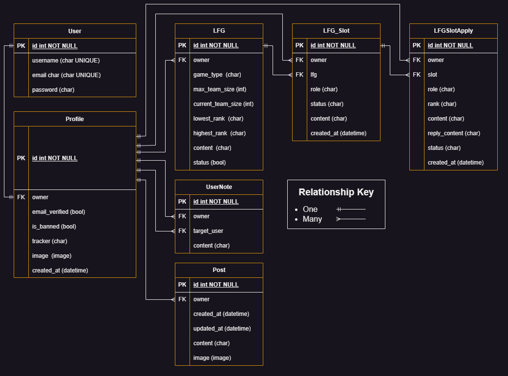

*Created using: [app.diagrams.net](https://app.diagrams.net/)*

#### Django

#### Python

##### Python packages

#### JavaScript

##### REACT

#### CSS

##### BootStrap

### Widgets

#### Cloudinary

[🔝](#table-of-contents)

---

## Testing

### HTML

### CSS

### JavaScript

### Python

#### Linters

#### Unit testing

#### Coverage

### User testing

[🔝](#table-of-contents)

---

## Bugs

### Unresolved

### Resolved

[🔝](#table-of-contents)

---

## Deployment

### GitHub - Cloning

### Cloudinary deployment

### Neon deployment

### Heroku

[🔝](#table-of-contents)

---

## Credits

### VS Code extensions

### Other tech

### Content

### Acknowledgements

[🔝](#table-of-contents)

---
