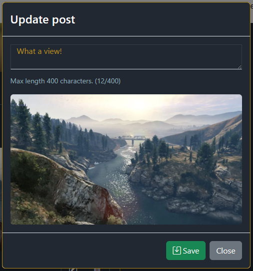
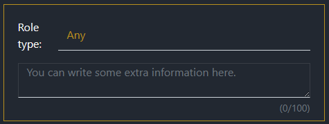

# 1. Squad Up


**Still to be completed in this README:**

  - Python
    - Unit testing
    - Coverage
    - User testing

## 1.1. Full stack website

**Built using**:\
REACT, Django Python, JavaScript, BootStrap, CSS and HTML.

**Also including**:\
Cloudinary.

## 1.2. Live site

[Hosted on Heroku](https://squadup-frontend.herokuapp.com/)

## 1.3. Repository

- [GitHub repository - FRONTEND](https://github.com/BobWritesCode/squadup_frontend)
- [GitHub repository - BACKEND](https://github.com/BobWritesCode/SquadUp_api)

## 1.4. Table of Contents

- [1. Squad Up](#1-squad-up)
  - [1.1. Full stack website](#11-full-stack-website)
  - [1.2. Live site](#12-live-site)
  - [1.3. Repository](#13-repository)
  - [1.4. Table of Contents](#14-table-of-contents)
  - [1.5. Objective](#15-objective)
  - [1.6. Brief](#16-brief)
    - [1.6.1. Squad Up - Team builder website](#161-squad-up---team-builder-website)
  - [1.7. UX - User Experience Design](#17-ux---user-experience-design)
    - [1.7.1. New user](#171-new-user)
    - [1.7.2. Registered user](#172-registered-user)
    - [1.7.3. Registered user - Team leader](#173-registered-user---team-leader)
    - [1.7.4. Registered user - Team Recruit](#174-registered-user---team-recruit)
  - [1.8. Development](#18-development)
    - [1.8.1. Agile design](#181-agile-design)
    - [1.8.2. GitHub issues](#182-github-issues)
    - [1.8.3. Issue numbers](#183-issue-numbers)
    - [1.8.4. User story](#184-user-story)
    - [1.8.5. Bug report](#185-bug-report)
    - [1.8.6. Feature request](#186-feature-request)
    - [1.8.7. Improvement request](#187-improvement-request)
    - [1.8.8. Choose assignees](#188-choose-assignees)
    - [1.8.9. Choose labels](#189-choose-labels)
    - [1.8.10. Choose Project](#1810-choose-project)
    - [1.8.11. Choose milestone](#1811-choose-milestone)
    - [1.8.12. Kanban board](#1812-kanban-board)
    - [1.8.13. Wireframes](#1813-wireframes)
      - [1.8.13.1. Homepage design](#18131-homepage-design)
      - [1.8.13.2. Sign in design](#18132-sign-in-design)
      - [1.8.13.3. Registration design](#18133-registration-design)
      - [1.8.13.4. Profile design](#18134-profile-design)
      - [1.8.13.5. Squad Finder design](#18135-squad-finder-design)
    - [1.8.14. Colour scheme](#1814-colour-scheme)
    - [1.8.15. Typography](#1815-typography)
    - [1.8.16. Imagery](#1816-imagery)
  - [1.9. Features](#19-features)
    - [1.9.1. Existing features](#191-existing-features)
      - [1.9.1.1. Navbar](#1911-navbar)
        - [1.9.1.1.1. Search bar](#19111-search-bar)
      - [1.9.1.2. Homepage](#1912-homepage)
      - [1.9.1.3. Registration](#1913-registration)
      - [1.9.1.4. Sign In](#1914-sign-in)
      - [1.9.1.5. Profile](#1915-profile)
        - [1.9.1.5.1. Profile Box](#19151-profile-box)
        - [1.9.1.5.2. Avatar update component](#19152-avatar-update-component)
        - [1.9.1.5.3. Username update component](#19153-username-update-component)
        - [1.9.1.5.4. Password update component](#19154-password-update-component)
        - [1.9.1.5.5. Email update component](#19155-email-update-component)
        - [1.9.1.5.6. Tracker update component](#19156-tracker-update-component)
        - [1.9.1.5.7. User notes component](#19157-user-notes-component)
        - [1.9.1.5.8. User Note update component](#19158-user-note-update-component)
      - [1.9.1.6. Posts](#1916-posts)
        - [1.9.1.6.1. New Post component](#19161-new-post-component)
        - [1.9.1.6.2. Post List component](#19162-post-list-component)
        - [1.9.1.6.3. Edit post component](#19163-edit-post-component)
        - [1.9.1.6.4. Delete post component](#19164-delete-post-component)
      - [1.9.1.7. Squad Finder page](#1917-squad-finder-page)
        - [1.9.1.7.1. Create group component](#19171-create-group-component)
        - [1.9.1.7.2. Create slot component](#19172-create-slot-component)
        - [1.9.1.7.3. Review applications](#19173-review-applications)
          - [1.9.1.7.3.1. Group view](#191731-group-view)
          - [1.9.1.7.3.2. Application modal](#191732-application-modal)
        - [1.9.1.7.4. Applications Review - Pagination](#19174-applications-review---pagination)
        - [1.9.1.7.5. Find Group component - Filter](#19175-find-group-component---filter)
        - [1.9.1.7.6. Find Group component - List](#19176-find-group-component---list)
        - [1.9.1.7.7. Request to join component](#19177-request-to-join-component)
        - [1.9.1.7.8. Request to join component - Context signal](#19178-request-to-join-component---context-signal)
        - [1.9.1.7.9. My Applications component](#19179-my-applications-component)
      - [1.9.1.8. Spinner](#1918-spinner)
      - [1.9.1.9. 404 Page](#1919-404-page)
    - [1.9.2. Future features](#192-future-features)
  - [1.10. Technologies used](#110-technologies-used)
    - [1.10.1. Logic](#1101-logic)
      - [1.10.1.1. Data model](#11011-data-model)
      - [1.10.1.2. REACT](#11012-react)
      - [1.10.1.3. Django Rest framework](#11013-django-rest-framework)
      - [1.10.1.4. Python](#11014-python)
        - [1.10.1.4.1. Python packages](#110141-python-packages)
      - [1.10.1.5. JavaScript](#11015-javascript)
        - [1.10.1.5.1. React Bootstrap](#110151-react-bootstrap)
      - [1.10.1.6. CSS](#11016-css)
        - [1.10.1.6.1. BootStrap](#110161-bootstrap)
    - [1.10.2. Widgets](#1102-widgets)
      - [1.10.2.1. Cloudinary](#11021-cloudinary)
  - [1.11. Testing](#111-testing)
    - [1.11.1. HTML](#1111-html)
    - [1.11.2. CSS](#1112-css)
    - [1.11.3. JavaScript](#1113-javascript)
      - [1.11.3.1. React Testing](#11131-react-testing)
      - [1.11.3.2. Completed Tests](#11132-completed-tests)
      - [1.11.3.3. Coverage](#11133-coverage)
      - [1.11.3.4. ESLint](#11134-eslint)
    - [1.11.4. Python](#1114-python)
      - [1.11.4.1. Linter](#11141-linter)
      - [1.11.4.2. Unit testing](#11142-unit-testing)
      - [1.11.4.3. Coverage](#11143-coverage)
    - [1.11.5. User testing](#1115-user-testing)
  - [1.12. Bugs](#112-bugs)
    - [1.12.1. Unresolved](#1121-unresolved)
    - [1.12.2. Resolved](#1122-resolved)
  - [1.13. Deployment](#113-deployment)
    - [1.13.1. GitHub - Cloning](#1131-github---cloning)
    - [1.13.2. Cloudinary deployment](#1132-cloudinary-deployment)
    - [1.13.3. Neon deployment](#1133-neon-deployment)
    - [1.13.4. Heroku](#1134-heroku)
  - [1.14. Credits](#114-credits)
    - [1.14.1. VS Code extensions](#1141-vs-code-extensions)
    - [1.14.2. Other tech](#1142-other-tech)
    - [1.14.3. Content](#1143-content)
    - [1.14.4. Acknowledgements](#1144-acknowledgements)

---

## 1.5. Objective

Design an interactive Full-Stack application using HTML, CSS and advanced JavaScript. The application will include a front-end repository and a backend repository.

Main technologies that need to be used:
HTML, CSS, JavaScript (React),Python (Django) and a relational database (recommending MySQL or Postgres).

[🔝](#14-table-of-contents)

---

## 1.6. Brief

- [1.6.1. Squad Up - Team builder website](#161-squad-up---team-builder-website)

### 1.6.1. Squad Up - Team builder website

The goals of this applications are:

- to provide a hub were players can build a team.
- group leaders will be able to create a team listing looking for players.
- searching players will be able to search for a group by using filters.

[🔝](#14-table-of-contents)

---

## 1.7. UX - User Experience Design

- [1.7.1. New user](#171-new-user)
- [1.7.2. Registered user](#172-registered-user)
- [1.7.3. Registered user - Team leader](#173-registered-user---team-leader)
- [1.7.4. Registered user - Team Recruit](#174-registered-user---team-recruit)

### 1.7.1. New user

> *"As a new user I can register so that I can access registered user functions."*
> [1.9.1.3. Registration](#1913-registration)

### 1.7.2. Registered user

> *"As a registered user I can login so that I can access logged in user functions."*
> [1.9.1.4. Sign In](#1914-sign-in)
>
> *"As a logged in user I can manage my profile so that I can make sure it reflects me accurately."*
> [1.9.1.5. Profile](#1915-profile)
>
> *"As a logged in user I can create a post that appears in my profile so that other users can view the post."*
> [1.9.1.6.1. New Post component](#19161-new-post-component)
>
> *"As a logged in user I can leave private notes of a player's profile so that next time I come across them, I have a way to remember their behaviors'."*
> [1.9.1.5.7. User notes component](#19157-user-notes-component)

### 1.7.3. Registered user - Team leader

> *"As a logged in user I can create a looking for group listing so that other users looking for a group can request to join my group."*
> [1.9.1.7.1. Create group component](#19171-create-group-component)
>
> *"As a looking for group owner I can review requests to join my group by accept or declining the request so that the requester will know if they are successful."*
> [1.9.1.7.3. Review applications](#19173-review-applications)
>
> *"As a looking for group owner I can kick a player from the group so that if they do not respond after joining, I can free the slot back up."*
> [1.9.1.7.3.2. Application modal](#191732-application-modal)

### 1.7.4. Registered user - Team Recruit

> *"As a logged in user I can request to join a group that is looking for a teammate so that they can review my profile and decided if to accept or reject me."*
> [1.9.1.7.7. Request to join component](#19177-request-to-join-component)
>
> *"As a user who has joined a group I can leave the group so that the slot is made available and I can join a different group."*
> [1.9.1.7.9. My Applications component](#19179-my-applications-component)

[🔝](#14-table-of-contents)

---

## 1.8. Development

- [1.8.1. Agile design](#181-agile-design)
- [1.8.2. GitHub issues](#182-github-issues)
- [1.8.3. Issue numbers](#183-issue-numbers)
- [1.8.4. User story](#184-user-story)
- [1.8.5. Bug report](#185-bug-report)
- [1.8.6. Feature request](#186-feature-request)
- [1.8.7. Improvement request](#187-improvement-request)
- [1.8.8. Choose assignees](#188-choose-assignees)
- [1.8.9. Choose labels](#189-choose-labels)
- [1.8.10. Choose Project](#1810-choose-project)
- [1.8.11. Choose milestone](#1811-choose-milestone)
- [1.8.12. Kanban board](#1812-kanban-board)
- [1.8.13. Wireframes](#1813-wireframes)
- [1.8.14. Colour scheme](#1814-colour-scheme)
- [1.8.15. Typography](#1815-typography)
- [1.8.16. Imagery](#1816-imagery)

### 1.8.1. Agile design

When taking on any application especially large and complicated application with different moving parts, where it's easy to jump from one part of the application to another, leaving the previous part incomplete and leaving room for error. It's best to come up with a strategy. This is where agile design comes in, it can help you identify all the different parts of the application that need to be completed, in which order may be best, and if you are in a team delegate tasks to people so everyone knows what their responsibilities are.

As part of the application, I heavily used GitHub Issues and GitHub Kanban board.

### 1.8.2. GitHub issues

I created 4 different templates for issues being raised:

- [1.8.4. User story](#184-user-story)
- [1.8.5. Bug report](#185-bug-report)
- [1.8.6. Feature request](#186-feature-request)
- [1.8.7. Improvement request](#187-improvement-request)

Each issue category played a part in helping easily identify the category the issue was going to be related to, and each has a different template for myself, and other users to provide useful information that will help resolve the issue.

When an issue is either being created or after. There are a few different options you can modify to help delegate the task and its priority. You can:

- [1.8.8. Choose assignees](#188-choose-assignees)
- [1.8.9. Choose labels](#189-choose-labels)
- [1.8.10. Choose Project](#1810-choose-project)
- [1.8.11. Choose milestone](#1811-choose-milestone)

[🔝](#14-table-of-contents)

### 1.8.3. Issue numbers

Every issue raised will have an issue number i.e., #1, #2, #3 and so on. If you put the issue number in the commit message, then that commit will automatically by GitHub be linked to that issue.

If you use certain keywords as well it will also automatically manage the issue such as 'bug: fixes #58'. This will automatically close that issue for you.

### 1.8.4. User story

[Link to user story template.](https://github.com/BobWritesCode/squadup_frontend/blob/master/.github/ISSUE_TEMPLATE/user-story.md)\
[Link to user story Issues.](https://github.com/users/BobWritesCode/projects/5/views/2?filterQuery=USER+STORY)

The user story was the first template I created, and this was basically to help start to build the idea of the application and what potential features were going to be needed.

Any user story was also allocated the tag 'new feature' automatically to help identify this was going to be a new feature.

### 1.8.5. Bug report

[Link to bug report template.](https://github.com/BobWritesCode/squadup_frontend/blob/master/.github/ISSUE_TEMPLATE/bug_report.md)\
[Link to bug report Issues.](https://github.com/users/BobWritesCode/projects/5/views/2?filterQuery=label%3Abug+)

As large and complex application, inevitably bugs came up. Bugs are very easy to get distracted by as they generally are discovered while working on an unrelated feature. When a bug comes up, I create a bug report so I can attend to it later.

Bug reports are allocated the tag 'bug' to help identify them. You can also opt to allocate it the tag 'priority' to show it is something that needs to be fixed immediately as it could be application breaking or may affect many users.

### 1.8.6. Feature request

[Link to feature request template.](https://github.com/BobWritesCode/squadup_frontend/blob/master/.github/ISSUE_TEMPLATE/new-feature.md)\
[Link to feature request Issues.](https://github.com/users/BobWritesCode/projects/5/views/2?filterQuery=label%3A%22new+feature%22)

While building the application new ideas on new features would come to mind. Some that would potentially be perfect for the first version of the application and some that potentially could be implemented later. Whenever a new feature came to mind, I would complete the feature request form.

Any feature request was also allocated the tag 'new feature' automatically to help identify this was going to be a new feature.

### 1.8.7. Improvement request

[Link to improvement request template.](https://github.com/BobWritesCode/squadup_frontend/blob/master/.github/ISSUE_TEMPLATE/improvement.md)\
[Link to improvement request Issues.](https://github.com/users/BobWritesCode/projects/5/views/2?filterQuery=label%3Aimprovement)

Either while using the application as a user or developing the application. I would realise improvements to feature that had already been built. To separate new features to improvements I created the Improvement Request form. Improvements could mainly be left to later in the application as it was important to make sure that all the main features were implemented first.

Any improvement Request was also allocated the tag 'improvement' automatically to help identify this was going to be a new feature.

### 1.8.8. Choose assignees

[Link to my assigned issues.](https://github.com/users/BobWritesCode/projects/5/views/2?filterQuery=assignee%3ABobWritesCode)

It may come as no surprise; I am the only person assigned issues on this project. Potentially in the future if the project grows and the team grows past me, then I would be able to assign other team members to tasks.

### 1.8.9. Choose labels

[Link to Frontend label choices for this application.](https://github.com/BobWritesCode/squadup_frontend/labels)\
[Link to Backend label choices for this application.](https://github.com/BobWritesCode/squadup_api/labels)

When creating an issue from an issue report, a label is automatically allocated but the user or a person creating the issue can choose to assign labels from the option available. For example, if something needs to be tagged as 'priority'.

### 1.8.10. Choose Project

It's probably obvious but all issues were assigned to this project. If you have one repository being used for several projects, it is useful to be able to choose the correct project.

### 1.8.11. Choose milestone

[Link to Frontend milestones for this application.](https://github.com/BobWritesCode/squadup_frontend/milestones)\
[Link to Backend milestones for this application.](https://github.com/BobWritesCode/squadup_api/milestones)

A milestone is essentially a marker in the applications journey i.e., Alpha, Beta, Release v1, v2 and so on... For a large application where development may be over a long period, such as a year. You may decide to allocate features to different quarters of the year. The milestone option allows you to do that. This essentially prioritizes which issues need to be dealt with by when.

In my application I created 3 milestones:

- Launch version 1.00
  - These are issues that 100% must be done ready for version 1.00.
- Non-essential for v1.00
  - These are issues that would be nice to have done but are mandatory.
- Post v1.00
  - These are issues that are mainly going to be features that can wait until version 1.00 has been completed and be implements into a future version.

### 1.8.12. Kanban board

[Link to application Kanban board.](https://github.com/users/BobWritesCode/projects/5)

A Kanban board is an agile application management tool that helps visualize tasks. It helps with the day-to-day works flow as you can easily see which tasks need to be completed. With GitHub applications you can have several views of the Kanban board. As you might want to have one for the team, and maybe views for each team member. Or different labels such as bugs or improvements.

[🔝](#14-table-of-contents)

---

### 1.8.13. Wireframes

- [1.8.13.1. Homepage design](#18131-homepage-design)
- [1.8.13.2. Sign in design](#18132-sign-in-design)
- [1.8.13.3. Registration design](#18133-registration-design)
- [1.8.13.4. Profile design](#18134-profile-design)
- [1.8.13.5. Squad Finder design](#18135-squad-finder-design)

Below are  wireframe that I designed to help build and represent the design of this application.

#### 1.8.13.1. Homepage design

<details><summary>PC / Large screen</summary> <!-- markdownlint-disable-line -->


</details>

<details><summary>Mobile / Small screen</summary> <!-- markdownlint-disable-line -->


</details>

#### 1.8.13.2. Sign in design

<details><summary>PC / Large screen</summary> <!-- markdownlint-disable-line -->


</details>

<details><summary>Mobile / Small screen</summary> <!-- markdownlint-disable-line -->


</details>

#### 1.8.13.3. Registration design

<details><summary>PC / Large screen</summary> <!-- markdownlint-disable-line -->


</details>

<details><summary>Mobile / Small screen</summary> <!-- markdownlint-disable-line -->


</details>

#### 1.8.13.4. Profile design

<details><summary>PC / Large screen</summary> <!-- markdownlint-disable-line -->


</details>

<details><summary>Mobile / Small screen</summary> <!-- markdownlint-disable-line -->


</details>

#### 1.8.13.5. Squad Finder design

<details><summary>PC / Large screen</summary> <!-- markdownlint-disable-line -->


</details>

<details><summary>Mobile / Small screen</summary> <!-- markdownlint-disable-line -->


</details>

### 1.8.14. Colour scheme

The 4 main colour's hex codes for this site are: B78F1D, 212731, 3F6974, FAFAFA.
These 4 colours contrast very nicely against each other, and the white text against the other 3 colours pass WCAG contrast scores.


### 1.8.15. Typography

We are using [BootStrap's](#110161-bootstrap) native font stack. As it provides a sharp and clear font that works perfectly with the projects overall styling.

[Link to BootStrap's documentation for Native font stack.](https://getbootstrap.com/docs/5.3/content/reboot/#native-font-stack)

### 1.8.16. Imagery

**This application comes with the following media:**

<details><summary>Squad Up logo - Variant 1</summary> <!-- markdownlint-disable-line -->


</details>

<details><summary>Squad Up logo - Variant 2</summary> <!-- markdownlint-disable-line -->


</details>

<details><summary>Squad Up logo - Variant 3</summary> <!-- markdownlint-disable-line -->


</details>

- This logo was created by myself. I tried to create a simplistic logo that could easily scaled and provided a premium look/feel.

<details><summary>Fav icon</summary> <!-- markdownlint-disable-line -->


</details>

- A miniature version of the Squad Up logo but with just the letter S. Making it easily identifiable in the browser.

Valorant rank badges.

- Use of these are covered within the [Riot 'Legal Jibber Jabber'](https://www.riotgames.com/en/legal).

**User uploaded images:**

The application allows users to upload images, currently there is no way to moderate these without accessing the SQL database. Future plans are to add an admin access area that will allow staff members moderate content on the application.

[🔝](#14-table-of-contents)

---

## 1.9. Features

- [1.9.1. Existing features](#191-existing-features)
- [1.9.2. Future features](#192-future-features)

### 1.9.1. Existing features

- [1.9.1.1. Navbar](#1911-navbar)
- [1.9.1.2. Homepage](#1912-homepage)
- [1.9.1.3. Registration](#1913-registration)
- [1.9.1.4. Sign In](#1914-sign-in)
- [1.9.1.5. Profile](#1915-profile)
- [1.9.1.6. Posts](#1916-posts)
- [1.9.1.7. Squad Finder page](#1917-squad-finder-page)
- [1.9.1.8. Spinner](#1918-spinner)

#### 1.9.1.1. Navbar

[Navbar.js](https://github.com/BobWritesCode/squadup_frontend/blob/master/src/components/NavBar.js)

The Navbar is designed to contrast the rest of the page. This make it more easily identifiable oppose to blending in with the page which can be confusing once you start scrolling down the page, as the NavBar sticks to the top of the browser window

<details><summary>Navbar snapshot - PC</summary> <!-- markdownlint-disable-line -->


</details>

<details><summary>Navbar snapshot - Mobile - Closed</summary> <!-- markdownlint-disable-line -->


</details>

<details><summary>Navbar snapshot - Mobile - Open</summary> <!-- markdownlint-disable-line -->


</details>

As you will see from the code below we use a [React Bootstrap Nav](https://react-bootstrap.github.io/components/navs/) component to create the applications' navigation bar.

``` js
<Navbar
  expanded={expanded}
  className={styles.NavBar}
  expand="md"
  fixed="top"
>
  <Container fluid>
    {/* Brand logo */}
    <Navbar.Brand>
      
    </Navbar.Brand>
    {/* Controls if nav is expanded or close for mobile */}
    <Navbar.Toggle
      aria-controls="navbarScroll"
      ref={ref}
      onClick={() => setExpanded(!expanded)}
    />
    <Navbar.Collapse id="navbarScroll">
      <Nav
        className="justify-content-end flex-grow-1 pe-3"
        style={{ maxHeight: '100px' }}
        navbarScroll
      >
        {/* Links to show depending in user is logged in or not */}
        {homeLink}
        {currentUser ? '' : signInLink}
        {currentUser ? '' : signUpLink}
        {currentUser ? lfgLink : ''}
        {currentUser ? profileLink : ''}
        {currentUser ? logoutLink : ''}
      </Nav>
    </Navbar.Collapse>
  </Container>
</Navbar>
```

---

##### 1.9.1.1.1. Search bar

[SearchBar.js](https://github.com/BobWritesCode/squadup_frontend/blob/master/src/components/utils/SearchBar.js)

<details><summary>Search bar preview</summary> <!-- markdownlint-disable-line -->


</details>

Users can search for other users using the custom built search bar.

The search bar provides the top 10 closest results the input from the user. The user can then click on a desired result to be taken to that user's profile page.

If the user click's anywhere else on the page the results will be removed.

---

#### 1.9.1.2. Homepage

[HomePage.js](https://github.com/BobWritesCode/squadup_frontend/blob/master/src/pages/HomePage.js)

The homepage is designed to be simple and provide a clear understanding of what the website is about when a first-time user visits. It also provides some direction on what the user should do next if they are not logged in. If the user is logged in the 'Quick links' change.

<details><summary>Homepage - PC</summary> <!-- markdownlint-disable-line -->


</details>

<details><summary>Homepage - Mobile</summary> <!-- markdownlint-disable-line -->


</details>

#### 1.9.1.3. Registration

[SignUpForm.js](https://github.com/BobWritesCode/squadup_frontend/blob/master/src/pages/auth/SignUpForm.js)

It's important that users can easily sign up, the sign-up form itself is designed to be simplistic. Asking for a username, email address, and password. Username and password will be what is required to login. Both the username and email address must be unique, and the user will be notified if they are not.

Currently email address serves no purpose on this application but it is planned in future updates to have email verification and account recovery.

<details><summary>Registration - PC</summary> <!-- markdownlint-disable-line -->


</details>

<details><summary>Registration - Mobile</summary> <!-- markdownlint-disable-line -->


</details>

<details><summary>Registration - Duplicate alert</summary> <!-- markdownlint-disable-line -->


</details>

#### 1.9.1.4. Sign In

[SignInForm.js](https://github.com/BobWritesCode/squadup_frontend/blob/master/src/pages/auth/SignInForm.js)

The login screen as many of us would expect is a nice simple user form to input their username and password.

If the user cannot be found, or password does not match the correct account they will get an notifying them so.

<details><summary>Sign In - PC</summary> <!-- markdownlint-disable-line -->


</details>

<details><summary>Sign In - Mobile</summary> <!-- markdownlint-disable-line -->


</details>

<details><summary>Sign In - Bad user credentials</summary> <!-- markdownlint-disable-line -->


</details>

#### 1.9.1.5. Profile

- [1.9.1.5.1. Profile Box](#19151-profile-box)
- [1.9.1.5.2. Avatar update component](#19152-avatar-update-component)
- [1.9.1.5.3. Username update component](#19153-username-update-component)
- [1.9.1.5.4. Password update component](#19154-password-update-component)
- [1.9.1.5.5. Email update component](#19155-email-update-component)
- [1.9.1.5.6. Tracker update component](#19156-tracker-update-component)
- [1.9.1.5.7. User notes component](#19157-user-notes-component)
- [1.9.1.5.8. User Note update component](#19158-user-note-update-component)

[Profile.js](https://github.com/BobWritesCode/squadup_frontend/blob/master/src/pages/profile/Profile.js)

The profile page is the place where a user can manager this profile such as username, password, email, tracker ID.

It is also the place where they can make posts to their own timelines. By visiting another user's profile they will only be able to view the time line, and see restricted information in the profile box.

User's can also leave a user note on a different person's profile. The user note left is only visible to the user leave the note.

<details><summary>Profile - PC</summary> <!-- markdownlint-disable-line -->


</details>

<details><summary>Profile - Mobile</summary> <!-- markdownlint-disable-line -->


</details>

##### 1.9.1.5.1. Profile Box

[Profile.js](https://github.com/BobWritesCode/squadup_frontend/blob/master/src/pages/profile/Profile.js)

<details><summary>Profile Box</summary> <!-- markdownlint-disable-line -->


</details>

The Profile Box is within the Profile.js. The profile box houses a few different components within it, including:

- Avatar update
- Username update
- Email update
- Password update
- Tracker update
- User Note
- User Note update

##### 1.9.1.5.2. Avatar update component

[AvatarUpdate.js](https://github.com/BobWritesCode/squadup_frontend/blob/master/src/components/profile/AvatarUpdate.js)

<details><summary>Avatar - Hover</summary> <!-- markdownlint-disable-line -->


</details>

<details><summary>Avatar update modal</summary> <!-- markdownlint-disable-line -->


</details>

The avatar update component allows a user to update their avatar image. The user can hover their mouse over, and then tap/click on their current avatar which will open a modal allowing them to update.

The avatar images are currently stored on Cloudinary. To make sure that the Cloudinary storage is not being filled up with users who constantly change their avatar. I have coded the server to check for a current avatar image, and delete the old one from the server before saving the new image in it's place.

``` python
# https://github.com/BobWritesCode/SquadUp_api/blob/master/profiles/views.py
if serializer.is_valid():
    image = serializer.validated_data.get('image')

    if image:
        if profile.image is not None and request.FILES:
            # Delete old image from Cloudinary server
            try:
                uploader.destroy(str(profile.image))
            except:
                pass

        if request.FILES:
            # Upload new image
            new_image = uploader.upload(
                request.FILES['image'],
                folder="squadup/avatars/",
                allowed_formats=['jpg', 'png', 'jpeg'],
                format='jpg'
            )
            serializer.validated_data['image'] = new_image['public_id']
            serializer.save()
```

##### 1.9.1.5.3. Username update component

[UsernameUpdate.js](https://github.com/BobWritesCode/squadup_frontend/blob/master/src/components/profile/UsernameUpdate.js)

<details><summary>Username update modal</summary> <!-- markdownlint-disable-line -->


</details>

Allows user to update their username. Their is a validation check to make sure the user is changing to a unique name, if not the user will receive an alert information them that the new name is not unique.

As this also changes the user object, the user object in the browser needs to be refreshed otherwise the use will be logged out and other unexpected errors can happen

``` js
/**
 * Handle sending form data to API and handle response
 *
 * If successful update username in browser.
 * If error, display any expected error message to the user.
 *
 * @param {*} event
 */
const handleSubmit = async (event) => {
  event.preventDefault();
  // Show spinner while API resolves.
  setShowSpinner(true);
  // Clear any error alerts.
  setErrors({});
  // Create new form to control data sent to API.
  const formData = new FormData();
  formData.append('username', username);
  try {
    await axiosReq.put(`/dj-rest-auth/user/`, formData);
    // If change successful update authentication in browser.
    setCurrentUser((prevUser) => ({
      ...prevUser,
      username,
    }));
    // Update the username in parent component.
    onUsernameChange(username);
    // Close modal.
    handleClose();
  } catch (err) {
    // Display any expected error messages.
    setErrors(err.response?.data);
  } finally {
    // Remove spinner.
    setShowSpinner(false);
  }
};
```

##### 1.9.1.5.4. Password update component

[PasswordUpdate.js](https://github.com/BobWritesCode/squadup_frontend/blob/master/src/components/profile/PasswordUpdate.js)

<details><summary>Password update modal</summary> <!-- markdownlint-disable-line -->


</details>

Allows the user to update their password. They are required to provide their current password, and a new password which they must type again to confirm, before submitting the change.

##### 1.9.1.5.5. Email update component

[EmailUpdate.js](https://github.com/BobWritesCode/squadup_frontend/blob/master/src/components/profile/EmailUpdate.js)

<details><summary>Email update modal</summary> <!-- markdownlint-disable-line -->


</details>

Allows the user to update their email address.

Currently email address's server no purpose in this application but it is part of future plans to use them for login, account verification and account recovery.

##### 1.9.1.5.6. Tracker update component

[TrackerUpdate.js](https://github.com/BobWritesCode/squadup_frontend/blob/master/src/components/profile/TrackerUpdate.js)

<details><summary>Tracker update modal</summary> <!-- markdownlint-disable-line -->


</details>

Allows user to update their tracker ID from tracker.gg.

To assist the user, clear instructions are given on the format to enter the ID.

In the future the form will be split into two inputs, one for the player name and the other for the ID. This will help the user in making sure the correct input is provided.

We will also look into if it would be possible to contact tracker.gg to check the input is correct, and providing feedback tot he user.

##### 1.9.1.5.7. User notes component

[UserNote.js](https://github.com/BobWritesCode/squadup_frontend/blob/master/src/components/profile/UserNote.js)

<details><summary>User note box</summary> <!-- markdownlint-disable-line -->


</details>

Allows users to leave an updatable note on any user's profile. The note is only visible to the user leaving the note. This so user's can leave information about that player, should they come across them again. Things like if they enjoyed playing with them or noticed a specific style to their play.

##### 1.9.1.5.8. User Note update component

[UserNoteUpdate.js](https://github.com/BobWritesCode/squadup_frontend/blob/master/src/components/profile/UserNoteUpdate.js)

<details><summary>User Note update modal</summary> <!-- markdownlint-disable-line -->


</details>

Opens up a modal where the user can edit their note.

#### 1.9.1.6. Posts

- [1.9.1.6.1. New Post component](#19161-new-post-component)
- [1.9.1.6.2. Post List component](#19162-post-list-component)
- [1.9.1.6.3. Edit post component](#19163-edit-post-component)
- [1.9.1.6.4. Delete post component](#19164-delete-post-component)

<details><summary>Posts container</summary> <!-- markdownlint-disable-line -->


</details>

A container on the [profile page](#1915-profile) for combing [new post](#19161-new-post-component), and [post list](#19162-post-list-component).

##### 1.9.1.6.1. New Post component

[NewPost.js](https://github.com/BobWritesCode/squadup_frontend/blob/master/src/components/posts/NewPost.js)

<details><summary>New post</summary> <!-- markdownlint-disable-line -->


</details>

Allows users to add posts to their own timeline.

Users can either write some text, post an image, or both.

##### 1.9.1.6.2. Post List component

[UserPosts.js](https://github.com/BobWritesCode/squadup_frontend/blob/master/src/components/posts/UserPosts.js)

<details><summary>Posts list</summary> <!-- markdownlint-disable-line -->


</details>

Shows all user's posts in a list. As you scroll down more posts get loaded until you reach the end.

[Link to Infinite scroll component package](https://www.npmjs.com/package/react-infinite-scroll-component)

``` js
/**
 * JSX element to show posts in a list.
 */
const ShowMain = (
  <>
    {/*This Infinite Scroll components, takes the data received from the API
    and saved to posts, and then maps the results into a JSX elements. It
    loads 10 results at a time, and as you scroll down and get near the bottom
    of the page it requests the next 10, and then loads them. This repeats
    until you reach the last item. */}
    <InfiniteScroll
      className={appStyles.NoScrollBars}
      children={posts.results.map((p) => (
        <Post key={p.id} {...p} setPosts={setPosts} />
      ))}
      dataLength={posts.results.length}
      loader={<LoadSpinner />}
      hasMore={!!posts.next}
      next={() => fetchMoreData(posts, setPosts)}
      endMessage={
        // Message displayed when user reaches the end of the list and no more
        // results to be loaded.
        <p style={{ textAlign: 'center' }}>No more posts to see.</p>
      }
    />
  </>
  );
```

I also wanted to make sure when a user creates a new post that it is automatically added to the top of the list without the need of having to refresh the page.

``` js
/**
 * This effect will add a new post created by the user to the top of the posts list.
 */
useEffect(() => {
  if (latestNewPost) {
    const fetchData = async () => {
      try {
        // Get latest post for user from server.
        const { data } = await axiosReq.get(`/posts/${latestNewPost}`);
        // Convert json string into obj.
        const jsonPost = JSON.parse(data.post);
        const newPost = jsonPost[0].fields;
        // Adding missing fields to object.
        newPost.id = jsonPost[0].pk;
        newPost.image = data.imageURL;
        // Add obj to existing obj array.
        setPosts((prevPosts) => ({
          ...prevPosts,
          results: [newPost, ...prevPosts.results],
        }));
      } catch {
        console.log('error');
      }
    };
    fetchData();
  }
}, [latestNewPost]);
```

##### 1.9.1.6.3. Edit post component

[PostEdit.js](https://github.com/BobWritesCode/squadup_frontend/blob/master/src/components/posts/PostEdit.js)

<details><summary>Edit post modal</summary> <!-- markdownlint-disable-line -->


</details>

Allows the user to edit the text on a post. It currently does not allow you to edit images, I feel this is very much industry standard to not allow to change images in posts.

Once updated, the change can be seem immediately in the post.

##### 1.9.1.6.4. Delete post component

[PostDelete.js](https://github.com/BobWritesCode/squadup_frontend/blob/master/src/components/posts/PostDelete.js)

<details><summary>Delete post modal</summary> <!-- markdownlint-disable-line -->


</details>

Allows user to delete their own post.

#### 1.9.1.7. Squad Finder page

- [1.9.1.7.1. Create group component](#19171-create-group-component)
- [1.9.1.7.2. Create slot component](#19172-create-slot-component)
- [1.9.1.7.3. Review applications](#19173-review-applications)
- [1.9.1.7.4. Applications Review - Pagination](#19174-applications-review---pagination)
- [1.9.1.7.5. Find Group component - Filter](#19175-find-group-component---filter)
- [1.9.1.7.6. Find Group component - List](#19176-find-group-component---list)
- [1.9.1.7.7. Request to join component](#19177-request-to-join-component)
- [1.9.1.7.8. Request to join component - Context signal](#19178-request-to-join-component---context-signal)
- [1.9.1.7.9. My Applications component](#19179-my-applications-component)

<details><summary>Squad Finder page - PC</summary> <!-- markdownlint-disable-line -->


</details>

<details><summary>Squad Finder - Mobile</summary> <!-- markdownlint-disable-line -->


</details>

Squad Finder is the main focus and provides the most complex functionality of this application. Within this page there are several components and those components have components within components.

As a user they will be able to:

- Create a group.
- Create slots within that group.
- Disband the group.
- Review requests of others that are looking to join their group.
- Search for a group.
- Request to join a another group.
- Review their requests to join other groups.
- Delete their requests to join other groups.

##### 1.9.1.7.1. Create group component

[CreateGroup.js](https://github.com/BobWritesCode/squadup_frontend/blob/master/src/components/groups/CreateGroup.js)

<details><summary>Create Group button</summary> <!-- markdownlint-disable-line -->


</details>
<details><summary>Create Group modal</summary> <!-- markdownlint-disable-line -->


</details>

Allow a user to create a group to promote their team, so other players can see their team in the listings and request to join.

For each group the user will be able to choose:

- Game type
- Team size
- Minimum rank
- Maximum rank
- Text area to provide extra content
- Add open slots, where other users can request to join the team.

##### 1.9.1.7.2. Create slot component

[CreateGroupSlot.js](https://github.com/BobWritesCode/squadup_frontend/blob/master/src/components/groups/CreateGroupSlot.js)

<details><summary>Create slot - Buttons</summary> <!-- markdownlint-disable-line -->


</details>
<details><summary>Create slot - New slot</summary> <!-- markdownlint-disable-line -->


</details>

Allows the user to add empty slots in the team. These are slots that other users can request to join.

User is able to easily add and remove slots using the buttons.

The amount of a slots a use can add is the team size minus 1.

The two things a user can choose when creating a slot is:

- Desired role.
- Extra context, via a text area.

##### 1.9.1.7.3. Review applications

- [1.9.1.7.3.1. Group view](#191731-group-view)
- [1.9.1.7.3.2. Application modal](#191732-application-modal)

###### 1.9.1.7.3.1. Group view

[ApplicationReviews.js](https://github.com/BobWritesCode/squadup_frontend/blob/master/src/components/groups/ApplicationReviews.js)

<details><summary>My Groups</summary> <!-- markdownlint-disable-line -->


</details>
<details><summary>No application requests waiting</summary> <!-- markdownlint-disable-line -->


</details>

If the button shows 0, then it means no one currently has a request for the slot, and the button will be disabled.

<details><summary>Application request waiting</summary> <!-- markdownlint-disable-line -->


</details>

If the button shows 1 or higher, then it means one or more people currently have a request for the slot, and the button will be enabled. Clicking the button will open up the reviews modal.

<details><summary>User left - Reopen slot</summary> <!-- markdownlint-disable-line -->


</details>

If the leader has accepted someone, but that person leaves afterwards. The button will change to reopen, to reopen the slot.

###### 1.9.1.7.3.2. Application modal

<details><summary>Application review modal</summary> <!-- markdownlint-disable-line -->


</details>

The application review allows the user to see all requests and either 'Reject' or 'Accept.

<details><summary>Application review - Rejected request</summary> <!-- markdownlint-disable-line -->


</details>

Rejecting a request will show it as rejected in the modal.

<details><summary>Application review - Accept request - Step 1</summary> <!-- markdownlint-disable-line -->


</details>

Choosing 'Accept' will change the modal slight. The user will need to provide some instructions to the successful requester on how to join their in game, or how to make contact.

<details><summary>Application review - Accept request - Step 2</summary> <!-- markdownlint-disable-line -->


</details>

Once the user has provided and hits 'Confirm Accept', the target user will be accepted and the slot will be closed to any more requests.

<details><summary>Application review - Accept request - Step 3</summary> <!-- markdownlint-disable-line -->


</details>

Next in 'My Groups' the slot will be closed and the accepted user's name will show in the button instead of a number.

<details><summary>Application review - Kick accepted request</summary> <!-- markdownlint-disable-line -->


</details>

<details><summary>Application review - Kick confirm</summary> <!-- markdownlint-disable-line -->


</details>

If the user needs to kick the player from the slow for any reason, they just click the button with the user's name in it, and then can click 'Kick from group' in the modal. The user will then need to confirm the kick by typing kick in the input then clicking 'Confirm Kick'. This will then delete every current request, so users can re-request to join even if they were rejected previously.

##### 1.9.1.7.4. Applications Review - Pagination

<details><summary>Pagination</summary> <!-- markdownlint-disable-line -->


</details>

To assist with going through all the potential requests for a slot. I have implement pagination from the React Bootstrap library. Unfortunately the pagination doesn't come with any logic to make it work and I have had to write all the logic myself.

I actually made 2 versions of the pagination depending on how many results there are.

**10 of less requests pagination:**

```js
/**
 * JSX Pagination to show is application count is 10 or less.
 */
const ShowPages10 = applications.results?.length > 0 && (
  <Pagination className={`mt-4 ${paginationStyles.Page}`}>
    {pageNumber === 0 ? (
      <Pagination.Prev disabled onClick={() => {}} />
    ) : (
      <Pagination.Prev onClick={() => setPageNumber(pageNumber - 1)} />
    )}
    {Array(applications.results.length)
      .fill()
      .map((_, i) =>
        pageNumber === i ? (
          <Pagination.Item key={i} active onClick={() => setPageNumber(i)}>
            {i + 1}
          </Pagination.Item>
        ) : (
          <Pagination.Item key={i} onClick={() => setPageNumber(i)}>
            {i + 1}
          </Pagination.Item>
        ),
      )}
    {pageNumber === applications.results.length - 1 ? (
      <Pagination.Next disabled onClick={() => setPageNumber(() => {})} />
    ) : (
      <Pagination.Next onClick={() => setPageNumber(pageNumber + 1)} />
    )}
  </Pagination>
);
```

**11 or more requests pagination:**

``` js
/**
 * JSX Pagination to show is application count is 11 or more.
 */
const ShowPages11Up = (
  <Pagination className={`mt-4 ${paginationStyles.Page}`}>
    {/* Prev page */}
    {pageNumber <= 0 ? (
      <Pagination.Prev disabled onClick={() => {}} />
    ) : (
      <Pagination.Prev onClick={() => setPageNumber(pageNumber - 1)} />
    )}

    {/* First page number */}
    {pageNumber === 0 ? (
      <Pagination.Item active onClick={() => setPageNumber(0)}>
        {1}
      </Pagination.Item>
    ) : (
      <Pagination.Item onClick={() => setPageNumber(0)}>{1}</Pagination.Item>
    )}

    <Pagination.Ellipsis disabled />

    {pageNumber >= 0 && pageNumber <= 3 ? (
      <>
        {/* Set up pagination 2-6, if the current page is 4 or less */}
        {Array(5)
          .fill()
          .map((_, i) =>
            pageNumber === i + 1 ? (
              <Pagination.Item
                key={i + 1}
                active
                onClick={() => setPageNumber(i + 1)}
              >
                {i + 2}
              </Pagination.Item>
            ) : (
              <Pagination.Item
                key={i + 1}
                onClick={() => setPageNumber(i + 1)}
              >
                {i + 2}
              </Pagination.Item>
            ),
          )}
      </>
    ) : pageNumber >= applications.count - 3 &&
      pageNumber <= applications.count ? (
      <>
        {/* Set up pagination last-5 to last-1, if the page is within 3 of the end */}
        {Array(5)
          .fill()
          .map((_, i) =>
            pageNumber === applications.count - 6 + i ? (
              <Pagination.Item
                key={applications.count - 6 + i}
                active
                onClick={() => setPageNumber(applications.count - 6 + i)}
              >
                {applications.count - 5 + i}
              </Pagination.Item>
            ) : (
              <Pagination.Item
                key={applications.count - 6 + i}
                onClick={() => setPageNumber(applications.count - 6 + i)}
              >
                {applications.count - 5 + i}
              </Pagination.Item>
            ),
          )}
      </>
    ) : (
      <>
        <Pagination.Item onClick={() => setPageNumber(pageNumber - 2)}>
          {pageNumber - 1}
        </Pagination.Item>
        <Pagination.Item onClick={() => setPageNumber(pageNumber - 1)}>
          {pageNumber}
        </Pagination.Item>
        <Pagination.Item active>{pageNumber + 1}</Pagination.Item>
        <Pagination.Item onClick={() => setPageNumber(pageNumber + 1)}>
          {pageNumber + 2}
        </Pagination.Item>
        <Pagination.Item onClick={() => setPageNumber(pageNumber + 2)}>
          {pageNumber + 3}
        </Pagination.Item>
      </>
    )}

    <Pagination.Ellipsis disabled />

    {/* Final page number */}
    {pageNumber === applications.count - 1 ? (
      <Pagination.Item
        active
        onClick={() => setPageNumber(applications.count - 1)}
      >
        {applications.count}
      </Pagination.Item>
    ) : (
      <Pagination.Item onClick={() => setPageNumber(applications.count - 1)}>
        {applications.count}
      </Pagination.Item>
    )}

    {/* Next page */}
    {pageNumber >= applications.count - 1 ? (
      <Pagination.Next disabled onClick={() => setPageNumber(() => {})} />
    ) : (
      <Pagination.Next onClick={() => setPageNumber(pageNumber + 1)} />
    )}
  </Pagination>
);
```

##### 1.9.1.7.5. Find Group component - Filter

[GroupList.js](https://github.com/BobWritesCode/squadup_frontend/blob/master/src/components/groups/GroupList.js)

<details><summary>Filters</summary> <!-- markdownlint-disable-line -->


</details>

Here the user can choose from the filters to narrow down the list as it grows. The filter choices are:

- Game type
- Role
- Minimum rank
- Maximum rank

There were two problems I needed to solved. Firstly out of the box Django Rest Framework does not have filters for less and greater than. Secondly, role is not part of the **[LFG](https://github.com/BobWritesCode/SquadUp_api/blob/master/lfg/models.py)** model that is used for the groups and sits in each slot for each group which is a different model called **[LFG_Slot](https://github.com/BobWritesCode/SquadUp_api/blob/master/lfg_slots/models.py)**.

To solve this problem I have created a custom filterset located in [SquadUp_api/lfg/filters.py](https://github.com/BobWritesCode/SquadUp_api/blob/master/lfg/filters.py). Then replace the `filterset_fields = []` with `filterset_class = LFGListFilter` in [SquadUp_api/lfg/views.py](https://github.com/BobWritesCode/SquadUp_api/blob/master/lfg/views.py).
Finally add roles to the serializer in [SquadUp_api/lfg/serializers.py](https://github.com/BobWritesCode/SquadUp_api/blob/master/lfg/serializers.py).

``` py
# SquadUp_api/lfg/filters.py
class LFGListFilter(FilterSet):
    lowest_rank__gte = NumberFilter(
        field_name='lowest_rank', lookup_expr='gte')
    lowest_rank__lte = NumberFilter(
        field_name='lowest_rank', lookup_expr='lte')
    highest_rank__gte = NumberFilter(
        field_name='highest_rank', lookup_expr='gte')
    highest_rank__lte = NumberFilter(
        field_name='highest_rank', lookup_expr='lte')
    role = CharFilter(field_name='lfg_slot__role', lookup_expr='contains')
```

``` py
# SquadUp_api/lfg/serializers.py
class LFGSerializer(serializers.ModelSerializer):
    owner = serializers.ReadOnlyField(source='owner.username')
    owner_id = serializers.ReadOnlyField(source='owner.pk')
    is_owner = serializers.SerializerMethodField()
    roles = serializers.SerializerMethodField()

    def get_is_owner(self, obj):
        request = self.context['request']
        return request.user == obj.owner

    def get_roles(self, obj):
        groups = LFG_Slot.objects.filter(lfg=obj.id)
        return [group.role for group in groups]
```

##### 1.9.1.7.6. Find Group component - List

[GroupList.js](https://github.com/BobWritesCode/squadup_frontend/blob/master/src/components/groups/GroupList.js)

<details><summary>Group list</summary> <!-- markdownlint-disable-line -->


</details>

The group list will show every group that is 'Open' which currently means they have at least 1 slot open. If a group has a closed slot then the user will not be able to request to join that group.

The group list is determined by the [filters applied](#19175-find-group-component---filter).

##### 1.9.1.7.7. Request to join component

[SlotApply.js](https://github.com/BobWritesCode/squadup_frontend/blob/master/src/components/groups/SlotApply.js)

<details><summary>Request to join - Apply button</summary> <!-- markdownlint-disable-line -->


</details>
<details><summary>Request to join - Modal</summary> <!-- markdownlint-disable-line -->


</details>
<details><summary>Request to join - Modal - Success</summary> <!-- markdownlint-disable-line -->


</details>

Allows users to request to join a group in an open slot. The requesting user can choose a role, and add some extra information via a textarea input for the group leader to see.

##### 1.9.1.7.8. Request to join component - Context signal

[SlotApply.js](https://github.com/BobWritesCode/squadup_frontend/blob/master/src/components/groups/SlotApply.js)\
[myApplicationsSignalContext.js](https://github.com/BobWritesCode/squadup_frontend/blob/master/src/contexts/myApplicationsSignalContext.js)\
[App.js](https://github.com/BobWritesCode/squadup_frontend/blob/master/src/App.js)

It's very simple to update a parent component by using props, but when you have a more distant component you need to create a signal that tells that component to refresh. I wanted it so when a user applies to join a group, that their My Applications list also updates as well. I achieved this by created a context, and then wrapped that around the components that I wanted to be able to communicate with each other.

``` js
// squadup_frontend/src/contexts/myApplicationsSignalContext.js
import { createContext } from 'react';

const myApplicationsSignalContext = createContext({
  myApplicationsSignal: false,
  setMyApplicationsSignal: () => {},
});

export default myApplicationsSignalContext;
```

``` js
// squadup_frontend/src/App.js
function App() {
  const [myApplicationsSignal, setMyApplicationsSignal] = useState(false);

  const contextValue = {
    myApplicationsSignal,
    setMyApplicationsSignal,
  };

  return (
    ...
      <myApplicationsSignalContext.Provider value={contextValue}>
        <Routes>
          ...
          <Route path="/lfg" element={<LFGPage />} />
          ...
        </Routes>
      </myApplicationsSignalContext.Provider>
    ...
  );
}
```

```js
// squadup_frontend/src/components/groups /MyApplications.js
const MyApplications = () => {
  // Context to force refresh when signal received.
  const { myApplicationsSignal, setMyApplicationsSignal } = useContext(
    myApplicationsSignalContext,
  );
  ...

  const handleOnUpdate = () => {
    ...
    setMyApplicationsSignal(!myApplicationsSignal);
  };

  useEffect(() => {
    ...
    // Make API call here when myApplicationsSignal receives state change locally or from another component.
    ...
  }, [currentUser, update, myApplicationsSignal]);
  ...
}
```

##### 1.9.1.7.9. My Applications component

[MyApplications.js](squadup_frontend/src/components/groups/MyApplications.js)

<details><summary>My Applications list</summary> <!-- markdownlint-disable-line -->


</details>
<details><summary>My Applications modal</summary> <!-- markdownlint-disable-line -->


</details>

Allows the user to review any open applications they currently have. They can either delete or edit the application.

Editing allows the user to update: Role, rank, and the extra information.

<details><summary>My Application - Rejected</summary> <!-- markdownlint-disable-line -->


</details>

<details><summary>My Application modal - Rejected</summary> <!-- markdownlint-disable-line -->


</details>

The above images show what the user can expect to see if their request has been rejected.

<details><summary>My Application - Accepted</summary> <!-- markdownlint-disable-line -->


</details>
<details><summary>My Application modal - Accepted</summary> <!-- markdownlint-disable-line -->


</details>

If accepted by the group leader, the user will see accepted in their applications. If they click on it to open the modal they will see the message the group leader provided when the group leader accepted the request.

#### 1.9.1.8. Spinner

[Spinner.js](https://github.com/BobWritesCode/squadup_frontend/blob/master/src/components/Spinner.js)

<details><summary>Spinner - Loading data example</summary> <!-- markdownlint-disable-line -->


</details>

By far the most common reused component in the code is the `<LoadSpinner />`.

To make sure the user is receiving feedback on their actions and they are aware that more data/content is coming. I have used a spinner from the React Bootstrap library.

``` js
// Example component showing how to add spinner, and how to code it to show while API is resolving.

const ExampleComp = () => {
  // Use to show spinner while waiting for API response
  const [showSpinner, setShowSpinner] = useState(false);

  /**
   * Example API call.
   */
  useEffect(
    () => {
      const fetchData = async () => {
        // Set spinner to show
        setShowSpinner(true);
        try {
          // Make API call with filter options.
          const { data } = await axios.get(`/api/url/`);
        } catch (err) {
          // Handle errors here.
        } finally {
          // Remove spinner.
          setShowSpinner(false);
        }
      };
      fetchData();
    },
    [/*Dependencies go here*/],
  );

  /**
   * JSX content to go here.
   */
  const ShowContent = (
    <>
      {/*Content to go here*/}
    </>
  );

  return (
    <>
      // If showSpinner true show spinner, else show content.
      {showSpinner ? <Spinner /> : ShowContent}
    </>
  );
};
```

#### 1.9.1.9. 404 Page

<details><summary>404 page snapshot</summary> <!-- markdownlint-disable-line -->


</details>

If the user tries to visit a URL path that is not valid they will be shown the 404 page, where there will be a button to take them back tot he homepage.

[🔝](#14-table-of-contents)

### 1.9.2. Future features

- [#63](https://github.com/BobWritesCode/squadup_frontend/issues/63) Admin area to moderate users and content.
- [#31](https://github.com/BobWritesCode/squadup_frontend/issues/31) Group Leader can manually open and close group/slot.
- [#64](https://github.com/BobWritesCode/squadup_frontend/issues/64) Email verification on registration.
- [#65](https://github.com/BobWritesCode/squadup_frontend/issues/65) Account Recovery / Forgotten Password.
- [#66](https://github.com/BobWritesCode/squadup_frontend/issues/66) Email login
- [#67](https://github.com/BobWritesCode/squadup_frontend/issues/67) Split input for tracker ID
- [#68](https://github.com/BobWritesCode/squadup_frontend/issues/68) Account deletion

[🔝](#14-table-of-contents)

---

## 1.10. Technologies used

- [1.10.1. Logic](#1101-logic)
- [1.10.2. Widgets](#1102-widgets)

### 1.10.1. Logic

- [1.10.1.1. Data model](#11011-data-model)
- [1.10.1.2. REACT](#11012-react)
- [1.10.1.3. Django Rest framework](#11013-django-rest-framework)
- [1.10.1.4. Python](#11014-python)
- [1.10.1.5. JavaScript](#11015-javascript)
- [1.10.1.6. CSS](#11016-css)

#### 1.10.1.1. Data model

**API models:**

- [Profile](https://github.com/BobWritesCode/SquadUp_api/blob/master/profiles/models.py)
- [Post](https://github.com/BobWritesCode/SquadUp_api/blob/master/posts/models.py)
- [UserNote](https://github.com/BobWritesCode/SquadUp_api/blob/master/user_notes/models.py)
- [LFG](https://github.com/BobWritesCode/SquadUp_api/blob/master/lfg/models.py)
- [LFG_Slot](https://github.com/BobWritesCode/SquadUp_api/blob/master/lfg_slots/models.py)
- [LFGSlotApply](https://github.com/BobWritesCode/SquadUp_api/blob/master/lfg_slots_apply/models.py)

The below entity relationship diagram (ERD) is a graphical representation that depicts relationships between the different models in this project. It also shows the different attributes and their types for each class.


*Created using: [app.diagrams.net](https://app.diagrams.net/)*

#### 1.10.1.2. React

[React website](https://react.dev/)

The core framework of this project for the frontend is React.

"React lets you build user interfaces out of individual pieces called components. Create your own React components like Thumbnail, LikeButton, and Video. Then combine them into entire screens, pages, and apps."

In this project, I have leveraged the power of React, a popular JavaScript library, to enhance the user experience of our application. By utilizing React libraries and implementing key features, I have significantly improved the overall usability, performance, and interactivity for our users. This document aims to highlight the specific features I have employed and how they have contributed to an improved user experience.

Some key React features utilised include:

- **React Router** by using features like: `<route>`, `<routes>`, `<link>` and `<navigate>`.
- **Conditional Rendering** by using features like `useState()` and `useEffect()`.
- **React Bootstrap** to help generate pre-built components like `modals`, `tables` and `forms`.

#### 1.10.1.3. Django Rest framework

[Django REST framework website](https://www.django-rest-framework.org/)

The core framework of this project for the backend is Django Rest framework.

"Django REST framework is a powerful and flexible toolkit for building Web APIs.

Some reasons you might want to use REST framework:

- The Web browsable API is a huge usability win for your developers.
- Authentication policies including packages for OAuth1a and OAuth2.
- Serialization that supports both ORM and non-ORM data sources.
- Customizable all the way down - just use regular function-based views if you don't need the more powerful features.
- Extensive documentation, and great community support.
- Used and trusted by internationally recognised companies including Mozilla, Red Hat, Heroku, and Eventbrite."

#### 1.10.1.4. Python

- [1.10.1.4.1. Python packages](#110141-python-packages)

[Python website](https://www.python.org/)

##### 1.10.1.4.1. Python packages

These are some of the notable python packages that are used in this application.

- [dj-rest-auth](https://dj-rest-auth.readthedocs.io/en/latest/)
  - "Since the introduction of django-rest-framework, Django apps have been able to serve up app-level REST   API endpoints. As a result, we saw a lot of instances where developers implemented their own REST registration API endpoints here and there, snippets, and so on. We aim to solve this demand by providing dj-rest-auth, a set of REST API endpoints to handle User Registration and Authentication tasks. By having these API endpoints, your client apps such as AngularJS, iOS, Android, and others can communicate to your Django backend site independently via REST APIs for User Management. Of course, we’ll add more API endpoints as we see the demand."

- [bleach](https://pypi.org/project/bleach/)
  - "Bleach is an allowed-list-based HTML sanitizing library that escapes or strips markup and attributes.

    Bleach can also linkify text safely, applying filters that Django’s urlize filter cannot, and optionally setting rel attributes, even on links already in the text.

    Bleach is intended for sanitizing text from untrusted sources. If you find yourself jumping through hoops to allow your site administrators to do lots of things, you’re probably outside the use cases. Either trust those users, or don’t.

    Because it relies on html5lib, Bleach is as good as modern browsers at dealing with weird, quirky HTML fragments. And any of Bleach’s methods will fix unbalanced or mis-nested tags."

- [cloudinary](https://pypi.org/project/cloudinary/)
  - "The Cloudinary Python SDK allows you to quickly and easily integrate your application with Cloudinary. Effortlessly optimize, transform, upload and manage your cloud's assets."

#### 1.10.1.5. JavaScript

- [1.10.1.5.1. React Bootstrap](#110151-react-bootstrap)

Other than React and React Bootstrap, only vanilla JavaScript has been used in this application.

##### 1.10.1.5.1. React Bootstrap

[React Bootstrap website](https://react-bootstrap.github.io/)

React-Bootstrap replaces the Bootstrap JavaScript. Each component has been built from scratch as a true React component, without unneeded dependencies like jQuery.

As one of the oldest React libraries, React-Bootstrap has evolved and grown alongside React, making it an excellent choice as your UI foundation.

#### 1.10.1.6. CSS

- [1.10.1.6.1. BootStrap](#110161-bootstrap)

[W3C CSS Homepage](https://www.w3.org/Style/CSS/)

##### 1.10.1.6.1. BootStrap

[BootStrap website](https://getbootstrap.com/)

BootStrap is a powerful framework that mainly focuses on providing each to implement CSS with some powerful JS features such as modals.

The project was built using BootStrap 5. 99% of the styling is done using BootStrap with only little bit down in the projects own CSS file, such as colours.

There are a few ways to install BootStrap, for this project we used CDNs. We also used BootStrap icons, which is a Free, high quality, open-source icon library with over 1,800 icons.

Add the following in the `index.html` to add Bootstrap to the application.

```html
<!-- React Bootstrap CSS Stylesheet version 5.2.3 -->
<link rel="stylesheet" href="https://cdn.jsdelivr.net/npm/bootstrap@5.2.3/dist/css/bootstrap.min.css"
  integrity="sha384-rbsA2VBKQhggwzxH7pPCaAqO46MgnOM80zW1RWuH61DGLwZJEdK2Kadq2F9CUG65" crossorigin="anonymous" />
```

Also add the following in the `index.html` to use Bootstrap icons.

```html
<!-- Bootstrap Icons -->
<link rel="stylesheet" href="https://cdn.jsdelivr.net/npm/bootstrap-icons@1.10.5/font/bootstrap-icons.css">
```

### 1.10.2. Widgets

- [1.10.2.1. Cloudinary](#11021-cloudinary)

#### 1.10.2.1. Cloudinary

Cloudinary is a powerful image and video hosting service that provides services to store, transform and optimize delivery of your images to your website via an API.

For setting up Cloudinary check out the [Cloudinary Deployment](#1132-cloudinary-deployment) section.

In Python you need to import Cloudinary into your project

```py
from cloudinary import uploader
```

The way I have used Cloudinary in this project is mainly focus on uploading images and destroying images.

It was also important to bear in mind that potentially hundreds, even thousands of images could be uploaded through the website, so storage management was something to think about.

One simple way images could build up is as images get replaced. The storage will be filled up with images that have been replaced but are no longer in use. So when an image is no longer needed, it is best to also delete it from the storage.

**Example of checking for an existing image, and deleting it before saving a new image:**

```py
# SquadUp_api/profiles/models.py
# class ProfileDetail(generics.RetrieveUpdateAPIView):
# def put(self, request, *args, **kwargs):

if image:
  if profile.image is not None and request.FILES:
      # Delete old image from Cloudinary server
      try:
          uploader.destroy(str(profile.image))
      except:
          pass

  if request.FILES:
      # Upload new image
      new_image = uploader.upload(
          request.FILES['image'],
          folder="squadup/avatars/",
          allowed_formats=['jpg', 'png', 'jpeg'],
          format='jpg'
      )
      serializer.validated_data['image'] = new_image['public_id']
      serializer.save()
```

[🔝](#14-table-of-contents)

---

## 1.11. Testing

- [1.11.1. HTML](#1111-html)
- [1.11.2. CSS](#1112-css)
- [1.11.3. JavaScript](#1113-javascript)
- [1.11.4. Python](#1114-python)
- [1.11.5. User testing](#1115-user-testing)

### 1.11.1. HTML

To validate all HTML, I used the [W3C validator](https://validator.w3.org/#validate_by_uri) by validating by URL.

| Page | Errors | Errors results? | Final result |
|---|---|---|---|
| Homepage | none |  | pass |
| Sign In | none |  | pass |
| Sign Up | none |  | pass |
| Profile | none |  | pass |
| Squad Finder | none |  | pass |
| 404 | none |  | pass |

### 1.11.2. CSS

I have used a combination of custom stylesheets and Bootstrap for the styling of this project. We do not need to test the Bootstrap CSS but we will test the custom code written. For the tests we are using [W3C CSS validation Service](https://jigsaw.w3.org/css-validator/#validate_by_input).

| Page | Errors | Errors results? | Final result |
|---|---|---|---|
| App.module.css | none |  | pass |
| Avatar.module.css | none |  | pass |
| Buttons.module.css | Value Error : border px is not a color value : px solid #284933 | Added missing 1 before the px | pass |
| Footer.module.css | none |  | pass |
| Forms.module.css | none |  | pass |
| Lists.module.css | none |  | pass |
| Modal.module.css | none |  | pass |
| NavBar.module.css | none |  | pass |
| Pagination.module.css | none |  | pass |
| Posts.module.css | none |  | pass |
| Profile.module.css | none |  | pass |
| SignUpForm.module.css | none |  | pass |
| Table.module.css | none |  | pass |

### 1.11.3. JavaScript

#### 1.11.3.1. React Testing

[React Testing Library](https://testing-library.com/docs/react-testing-library/intro/)

"The React Testing Library is a very light-weight solution for testing React components. It provides light utility functions on top of react-dom and react-dom/test-utils, in a way that encourages better testing practices."

#### 1.11.3.2. Completed Tests

The primary focus of the current testing was to mainly focus on the rendering of each component. Making sure that there are no critical errors for any component to load.

<details><summary>Test List</summary> <!-- markdownlint-disable-line -->


</details>

A key mechanic I had to use was mocking. All the API mocks are in [squadup_frontend/src/mocks/handler.js](https://github.com/BobWritesCode/squadup_frontend/blob/master/src/mocks/handler.js).

```js
//squadup_frontend/src/mocks/handler.js

...
// Example mock for loading a profile page.
rest.get(`${baseURL}profiles/28`, (req, res, ctx) => {
  return res(
    ctx.json({
      id: 28,
      owner: 'JimmyBob',
      tracker: '',
      image:
        'https://res.cloudinary.com/dxjilemam/image/upload/v1/squadup/avatars/download_1_tkm6at',
      created_at: '2023-05-25T15:36:12.910596Z',
      is_owner: false,
      email: 'test@test.me',
    }),
  );
}),
...
```

```js
//squadup_frontend/src/pages/profile/__tests__/Profile.test.js

// Mock useParams to provide the id parameter
jest.mock('react-router-dom', () => ({
  ...jest.requireActual('react-router-dom'),
  useParams: jest.fn(),
}));

describe('Profile component test', () => {
  const renderComponent = () =>
    render(
      <Router>
        <CurrentUserProvider>
          <ProfileDataProvider>
            <Profile />
          </ProfileDataProvider>
        </CurrentUserProvider>
      </Router>,
    );

  it('renders the component', async () => {
    // Mock Params to use.
    useParams.mockReturnValue({ id: '28' });
    renderComponent();
    // This act makes sure that the render is completed because of any state changes after useEffect() API is resolved.
    await act(async () => {
      expect(true).toEqual(true);
    });
  });
});
```

#### 1.11.3.3. Coverage

There are a significant amount more tests I could do to make sure that all key functions are covered. It is possible to get a report called 'coverage' that shows you in an interactive HTML format what parts of the code have been and not tested.

Here is a snapshot of the current report:
<details><summary>Coverage snapshot</summary> <!-- markdownlint-disable-line -->


</details>

#### 1.11.3.4. ESLint

[ESLint website](https://eslint.org/)

"ESLint statically analyzes your code to quickly find problems. It is built into most text editors and you can run ESLint as part of your continuous integration pipeline."

I have used ESLint to provide a more robust codebase, and help enforce consistency throughout. When I installed ESLint it did mean I had no go through every .js file and make changes to conform with the ESLint rules. Most of these changes can be seen in this [commit](https://github.com/BobWritesCode/squadup_frontend/commit/4f79d0e9643db3681e00fba9806a74f38c6174a0).

This is the configuration used:

```js
module.exports = {
  env: {
    browser: true,
    es2021: true,
  },
  extends: ['eslint:recommended', 'plugin:react/recommended'],
  overrides: [],
  parserOptions: {
    ecmaVersion: 'latest',
    sourceType: 'module',
  },
  plugins: ['react'],
  rules: {
    indent: ['error', 2],
    'linebreak-style': ['error', 'unix'],
    quotes: ['error', 'single'],
    semi: ['error', 'always'],
  },
};
```

### 1.11.4. Python

- [1.11.4.1. Linter](#11141-linter)
- [1.11.4.2. Unit testing](#11142-unit-testing)
- [1.11.4.3. Coverage](#11143-coverage)

#### 1.11.4.1. Linter

For the python linter I went with [pycodestyle](https://pycodestyle.pycqa.org/en/latest/) as this was the former pep8.

In commit [47b5b04](https://github.com/BobWritesCode/SquadUp_api/commit/47b5b04fd615f121ff4a0ace0cd503ec3cdcf3c1), I went through every .py file and made the advised changes.

This helps make sure code is formatted to an industry standard and makes the code easier to read and for other developers to work on.

#### 1.11.4.2. Unit testing

#### 1.11.4.3. Coverage

### 1.11.5. User testing

[🔝](#14-table-of-contents)

---

## 1.12. Bugs

- [1.12.1. Unresolved](#1121-unresolved)
- [1.12.2. Resolved](#1122-resolved)

When a bug is identified a user can raise an issue in GitHub to flag it. The user will need to complete a bug report, but this helps identify the bug and know what the user expected. As I work through the project numerous of bugs would come up, but to make sure I stayed on track and focused at 1 task at a time, I raised an issue to handle the bug later.


### 1.12.1. Unresolved

[Link to unresolved bugs](https://github.com/users/BobWritesCode/projects/5/views/2?filterQuery=label%3Abug+-status%3ADone&visibleFields=%5B%22Title%22%2C%22Assignees%22%2C%22Status%22%2C%22Labels%22%2C%22Milestone%22%2C%22Repository%22%5D)

### 1.12.2. Resolved

[Link to resolved bugs](https://github.com/users/BobWritesCode/projects/5/views/2?filterQuery=label%3Abug+status%3ADone&visibleFields=%5B%22Title%22%2C%22Assignees%22%2C%22Status%22%2C%22Labels%22%2C%22Milestone%22%2C%22Repository%22%5D)

[🔝](#14-table-of-contents)

---

## 1.13. Deployment

- [1.13.1. GitHub - Cloning](#1131-github---cloning)
- [1.13.2. Cloudinary deployment](#1132-cloudinary-deployment)
- [1.13.3. Neon deployment](#1133-neon-deployment)
- [1.13.4. Heroku](#1134-heroku)

### 1.13.1. GitHub - Cloning

To clone using GitHub:

Go to the project you wish to clone.

<details><summary>Cloudinary - Site</summary> <!-- markdownlint-disable-line -->


</details>

- **Option 1:** If you are using GitPod you can download the [Google Chrome GitPod extension](https://chrome.google.com/webstore/detail/gitpod-always-ready-to-co/dodmmooeoklaejobgleioelladacbeki) then you can just click on the green GitPod button

- **Option 2:** Click the 'Code' button. This open options for you to clone your preferred way.

### 1.13.2. Cloudinary deployment

Go to the Cloudinary website [https://cloudinary.com/](https://cloudinary.com/)

<details><summary>Cloudinary - Site</summary> <!-- markdownlint-disable-line -->


</details>

You can either Log in if you have a current account or create a new account with your email address.

<details><summary>Cloudinary - Log in options</summary> <!-- markdownlint-disable-line -->


</details>

Once you have logged in or completed the registration you are taken to the main console page.

<details><summary>Cloudinary - Console page</summary> <!-- markdownlint-disable-line -->


</details>

Click the 'Dashboard' button which is located in the nav bar.

<details><summary>Cloudinary - Dashboard button</summary> <!-- markdownlint-disable-line -->


</details>

And you are now on the screen which shows you all the credential information you will require.

<details><summary>Cloudinary - Dashboard page</summary> <!-- markdownlint-disable-line -->


</details>

### 1.13.3. Neon deployment

You can choose your own SQL database provider but for this project I used Neon which uses PostgresSQL databases.

Go to the Neon's website [https://www.neon.tech/](https://www.neon.tech/).

<details><summary>Neon - Website</summary> <!-- markdownlint-disable-line -->


</details>

Sign in or sign up for a new account.

<details><summary>Neon - Sign in / Sign up</summary> <!-- markdownlint-disable-line -->


</details>

Once you are signed in, click **Create a project**.

<details><summary>Neon - Create a project</summary> <!-- markdownlint-disable-line -->


</details>

Provide a project name, and choose a location where you wish the database to be located.

<details><summary>Neon - Project name and location</summary> <!-- markdownlint-disable-line -->


</details>

Once created you will see details on how to contact your database to your application. Save the psql details as you will need them for Heroku.

<details><summary>Neon - Project connection details</summary> <!-- markdownlint-disable-line -->


</details>

### 1.13.4. Heroku

**You will need to set up TWO Heroku projects, one for the front end and the other for the backend.**

Navigate to your Heroku dashboard,

Click "New" and select "Create new app".

<details><summary>Heroku - Choose new app</summary> <!-- markdownlint-disable-line -->


</details>

Input a meaningful name for your app and choose the region best suited to your location.

<details><summary>Heroku - Choose region</summary> <!-- markdownlint-disable-line -->


</details>

Select "Settings" from the tabs.

<details><summary>Heroku - Settings</summary> <!-- markdownlint-disable-line -->


</details>

Click "Reveal Config Vars".

For the React front end application there are actually no VARs you need to input

<details><summary>Heroku vars - Frontend</summary> <!-- markdownlint-disable-line -->


</details>

For the Django Rest framework these are the following required vars.

<details><summary>Heroku vars - Backend</summary> <!-- markdownlint-disable-line -->


</details>

For this project you will need the following Vars:

- **ALLOWED_HOST** - The URL of the application *(i.e. yourBackendAppName.herokuapp.com)*.
- **CLIENT_ORIGIN** - The URL of the frontend application *(i.e. [https://yourBackendAppName.herokuapp.com](.))*.
- **CLOUDINARY_URL** - Get from Cloudinary.
- **DATABASE_URL** - Get from your SQL provider.
- **DISABLE_COLLECTSTATIC** - Set to '1' (without '')
- **SECRET_KEY** - This is your Django project secret key, generated by your Django project. You can generate a new key that is different from your localhost version.

<details><summary>Cloudinary - Dashboard page</summary> <!-- markdownlint-disable-line -->


</details>

Select "Deploy" from the tabs.

<details><summary>Heroku - Select deploy</summary> <!-- markdownlint-disable-line -->


</details>

Select "GitHub - Connect to GitHub" from deployment methods.

<details><summary>Heroku GitHub connect</summary> <!-- markdownlint-disable-line -->


</details>

Click "Connect to GitHub" in the created section.

<details><summary>Heroku GitHub Connect 2</summary> <!-- markdownlint-disable-line -->


</details>

Search for the GitHub repository by name.

Click to 'Connect' to the relevant repo.

<details><summary>Heroku - Choose GitHub repo</summary> <!-- markdownlint-disable-line -->


</details>

Either click ‘Enable Automatic Deploys’ for automatic deploys or ‘Deploy Branch’ to deploy manually. Manually deployed branches will need re-deploying each time the repo is updated.

<details><summary>Heroku - Deploy</summary> <!-- markdownlint-disable-line -->


</details>

Click 'View' to view the deployed site.\
*Note: It may take a moment to become available.*

<details><summary>Heroku - View app</summary> <!-- markdownlint-disable-line -->


</details>

[🔝](#14-table-of-contents)

---

## 1.14. Credits

- [1.14.1. VS Code extensions](#1141-vs-code-extensions)
- [1.14.2. Other tech](#1142-other-tech)
- [1.14.3. Content](#1143-content)
- [1.14.4. Acknowledgements](#1144-acknowledgements)

### 1.14.1. VS Code extensions

These are some notable VS extensions that have really helped me with this project.

- [Python](https://marketplace.visualstudio.com/items?itemName=ms-python.python)
- [Pylance](https://marketplace.visualstudio.com/items?itemName=ms-python.vscode-pylance)
- [SQLite](https://marketplace.visualstudio.com/items?itemName=alexcvzz.vscode-sqlite)
- [Auto Close Tag](https://open-vsx.gitpod.io/extension/formulahendry/auto-close-tag)
- [Code Spell Checker](https://marketplace.visualstudio.com/items?itemName=streetsidesoftware.code-spell-checker)
- [empty-indent](https://marketplace.visualstudio.com/items?itemName=DmitryDorofeev.empty-indent)
- [ESLint](https://marketplace.visualstudio.com/items?itemName=dbaeumer.vscode-eslint)
- [markdownlint](https://marketplace.visualstudio.com/items?itemName=DavidAnson.vscode-markdownlint)
- [indent-rainbow](https://marketplace.visualstudio.com/items?itemName=oderwat.indent-rainbow)
- [prettier](https://marketplace.visualstudio.com/items?itemName=esbenp.prettier-vscode)

### 1.14.2. Other tech

- [Online Spellcheck](https://www.online-spellcheck.com/): To check spelling.
- [Balsamiq](https://balsamiq.com/wireframes/): To create wireframes.
- [diagrams.net](https://app.diagrams.net/): To create ERD.
- [ShareX](https://getsharex.com/): Used to snip screenshots.
- [Photoshop](https://www.adobe.com/uk/products/photoshop.html): Used to create logo.

### 1.14.3. Content

All code other then libraries used was my own. Some of the code though was influenced by Code Institute from their walkthroughs but I avoided direct copying of code where possible to make this project my own.

### 1.14.4. Acknowledgements

I like to acknowledge Code Institute who helped my in learning React, and provided educational content, and code-alongs.

[🔝](#14-table-of-contents)

---
