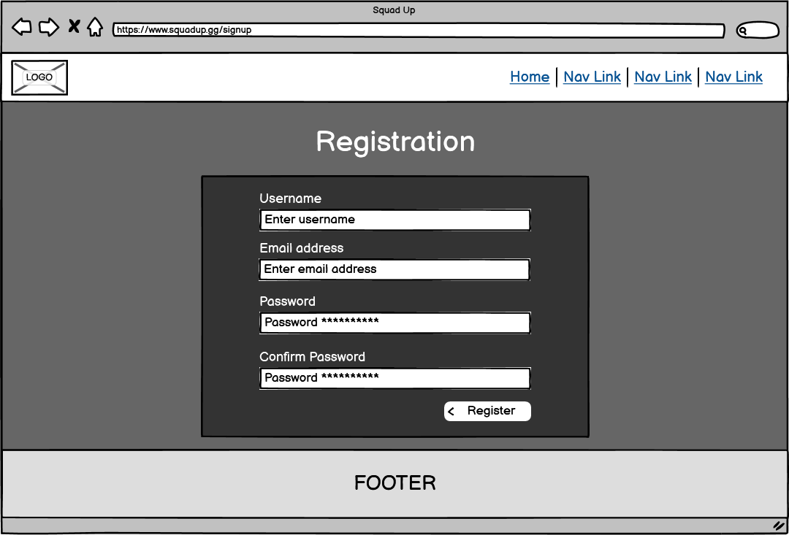
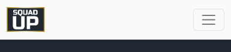
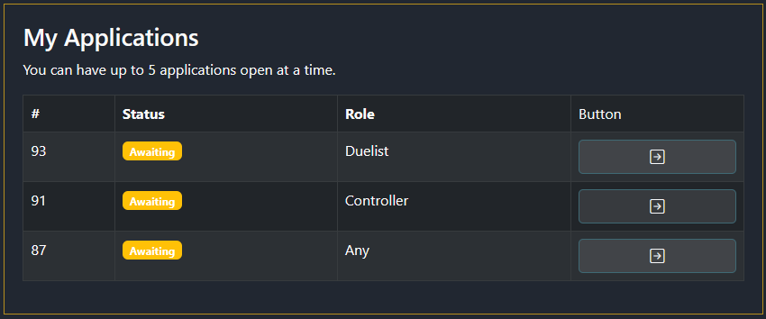

# Squad Up

## Full stack website

**Built using**:\
REACT, Django Python, JavaScript, BootStrap, CSS and HTML.

**Also including**:\
Cloudinary.


## Live site

[Hosted on Heroku](https://squadup-frontend.herokuapp.com/)

## Repository

- [GitHub repository - FRONTEND](https://github.com/BobWritesCode/squadup_frontend)
- [GitHub repository - BACKEND](https://github.com/BobWritesCode/SquadUp_api)

## Table of Contents

- [Squad Up](#squad-up)
  - [Live site](#live-site)
  - [Repository](#repository)
  - [Table of contents](#table-of-contents)
  - [Objective](#objective)
  - [Brief](#brief)
    - [Squad Up - Team builder website](#squad-up---team-builder-website)
  - [UX - User Experience Design](#ux---user-experience-design)
    - [Site-visitor](#site-visitor)
    - [Server-owner](#server-owner)
    - [Site-admin](#site-admin)
  - [Development](#development)
    - [Agile design](#agile-design)
      - [GitHub issues](#github-issues)
        - [Issue numbers](#issue-numbers)
        - [User story](#user-story)
        - [Bug report](#bug-report)
        - [Feature request](#feature-request)
        - [Improvement request](#improvement-request)
        - [Assign an assignee or assignees](#choose-assignees)
        - [Apply labels](#choose-labels)
        - [Choose the project](#choose-project)
        - [Choose the milestone](#choose-milestone)
      - [Kanban board](#kanban-board)
    - [Wireframes](#wireframes)
      - [Homepage design](#homepage-design)
      - [Squad Finder design](#listings-design)
      - [Profile design](#full-listing-design)
    - [Colour scheme](#colour-scheme)
    - [Typography](#typography)
    - [Imagery](#imagery)
  - [Features](#features)
    - [Existing features](#existing-features)
      - [Navbar](#navbar)
      - [Homepage](#homepage)
      - [Profile](#profile)
        - [Profile Box](#profile-box)
        - [User notes](#user-notes)
        - [Posts](#posts)
      - [Squad Finder](#squad-finger)
          - [Create group](#create-group)
            - [Create slot](#create-slot)
          - [Review applications](#review-applications)
          - [Find Group](#find-group)
            -[Request to join](#request-to-join)
          - [Review my requests](#review-my-requests)
            - [Delete request](#delete-requests)
      - [User authentication](#user-authentication)
        - [Sign up](#sign-up)
        - [Login](#login)
        - [Change password](#forgotten-password)
    - [Features left to implement](#features-left-to-implement)
  - [Technologies used](#technologies-used)
    - [Logic](#logic)
      - [Data model](#data-model)
      - [Django](#django)
      - [Python](#python)
        - [Python packages](#python-packages)
      - [JavaScript](#javascript)
        - [REACT](#jquery)
      - [CSS](#css)
        - [BootStrap](#bootstrap)
    - [Widgets](#widgets)
      - [Cloudinary](#cloudinary)
  - [Testing](#testing)
    - [HTML](#html-testing)
    - [CSS](#css-testing)
    - [JavaScript](#javascript-testing)
    - [Python](#python-testing)
      - [Linters](#python-linters)
      - [Unit testing](#unit-testing)
      - [Coverage](#coverage)
    - [User testing](#user-testing)
  - [Bugs](#bugs)
    - [Unresolved](#unresolved)
    - [Resolved](#resolved)
  - [Deployment](#development)
    - [GitHub - Cloning](#github---cloning)
    - [Cloudinary deployment](#cloudinary-deployment)
    - [Neon deployment](#neon)
    - [Heroku](#hero)
  - [Credits](#credits)
    - [VS Code extensions](#vs-code-extensions)
    - [Other tech](#other-tech)
    - [Content](#content)
    - [Acknowledgements](#acknowledgements)

---

## Objective

Design an interactive Full-Stack application using HTML, CSS and advanced JavaScript. The application will include a front-end repository and a backend repository.

Main technologies that need to be used:
HTML, CSS, JavaScript (React),Python (Django) and a relational database (recommending MySQL or Postgres).

[🔝](#table-of-contents)

---

## Brief

### Squad Up - Team builder website

The goals of this applications are:

- to provide a hub were players can build a team.
- group leaders will be able to create a team listing looking for players.
- searching players will be able to search for a group by using filters.

[🔝](#table-of-contents)

---

## UX - User Experience Design

### New user

> *"As a new user I can register so that I can access registered user functions."*

### Registered user

> *"As a registered user I can login so that I can access logged in user functions."*
>
> *"As a logged in user I can manage my profile so that I can make sure it reflects me accurately."*
>
> *"As a logged in user I can create a post that appears in my profile so that other users can view the post."*
>
> *"As a logged in user I can leave private notes of a player's profile so that next time I come across them, I have a way to remember their behaviors'."*

### Registered user - Team leader

> *"As a logged in user I can create a looking for group listing so that other users looking for a group can request to join my group."*
>
> *"As a looking for group owner I can review requests to join my group by accept or declining the request so that the requester will know if they are successful."*
>
> *"As a looking for group owner I can kick a player from the group so that if they do not respond after joining, I can free the slot back up."*

### Registered user - Team Recruit

> *"As a user who has joined a group I can leave the group so that the slot is made available and I can join a different group."*
>
> *"As a logged in user I can request to join a group that is looking for a teammate so that they can review my profile and decided if to accept or reject me."*

[🔝](#table-of-contents)

---

## Development

### Agile design

- [GitHub Issues](#github-issues)
  - [Issue numbers](#issue-numbers)
  - [User Story](#user-story)
  - [Bug Report](#bug-report)
  - [Feature Request](#feature-request)
  - [Improvement Request](#improvement-request)
  - [Assign an assignee or assignees](#choose-assignees)
  - [Apply labels](#choose-labels)
  - [Choose the project](#choose-project)
  - [Choose the milestone](#choose-milestone)
- [Kanban Board](#kanban-board)

When taking on any application especially large and complicated application with different moving parts, where it's easy to jump from one part of the application to another, leaving the previous part incomplete and leaving room for error. It's best to come up with a strategy. This is where agile design comes in, it can help you identify all the different parts of the application that need to be completed, in which order may be best, and if you are in a team delegate tasks to people so everyone knows what their responsibilities are.

As part of the application, I heavily used GitHub Issues and GitHub Kanban board.

### GitHub issues

I created 4 different templates for issues being raised:

- [User story](#user-story)
- [Bug report](#bug-report)
- [Feature request](#feature-request)
- [Improvement request](#improvement-request)

Each issue category played a part in helping easily identify the category the issue was going to be related to, and each has a different template for myself, and other users to provide useful information that will help resolve the issue.

When an issue is either being created or after. There are a few different options you can modify to help delegate the task and its priority. You can:

- [Assign an assignee or assignees](#choose-assignees)
- [Apply labels](#choose-labels)
- [Choose the project](#choose-project)
- [Choose the milestone](#choose-milestone)

[🔝](#table-of-contents)

### Issue numbers

Every issue raised will have an issue number i.e., #1, #2, #3 and so on. If you put the issue number in the commit message, then that commit will automatically by GitHub be linked to that issue.

If you use certain keywords as well it will also automatically manage the issue such as 'bug: fixes #58'. This will automatically close that issue for you.

### User story

[Link to user story template.](https://github.com/BobWritesCode/squadup_frontend/blob/master/.github/ISSUE_TEMPLATE/user-story.md)

[Link to user story Issues.](https://github.com/users/BobWritesCode/projects/5/views/2?filterQuery=USER+STORY)

The user story was the first template I created, and this was basically to help start to build the idea of the application and what potential features were going to be needed.

Any user story was also allocated the tag 'new feature' automatically to help identify this was going to be a new feature.

### Bug report

[Link to bug report template.](https://github.com/BobWritesCode/squadup_frontend/blob/master/.github/ISSUE_TEMPLATE/bug_report.md)

[Link to bug report Issues.](https://github.com/users/BobWritesCode/projects/5/views/2?filterQuery=label%3Abug+)

As large and complex application, inevitably bugs came up. Bugs are very easy to get distracted by as they generally are discovered while working on an unrelated feature. When a bug comes up, I create a bug report so I can attend to it later.

Bug reports are allocated the tag 'bug' to help identify them. You can also opt to allocate it the tag 'priority' to show it is something that needs to be fixed immediately as it could be application breaking or may affect many users.

### Feature request

[Link to feature request template.](https://github.com/BobWritesCode/squadup_frontend/blob/master/.github/ISSUE_TEMPLATE/new-feature.md)

[Link to feature request Issues.](https://github.com/users/BobWritesCode/projects/5/views/2?filterQuery=label%3A%22new+feature%22)

While building the application new ideas on new features would come to mind. Some that would potentially be perfect for the first version of the application and some that potentially could be implemented later. Whenever a new feature came to mind, I would complete the feature request form.

Any feature request was also allocated the tag 'new feature' automatically to help identify this was going to be a new feature.

### Improvement request

[Link to improvement request template.](https://github.com/BobWritesCode/squadup_frontend/blob/master/.github/ISSUE_TEMPLATE/improvement.md)

[Link to improvement request Issues.](https://github.com/users/BobWritesCode/projects/5/views/2?filterQuery=label%3Aimprovement)

Either while using the application as a user or developing the application. I would realise improvements to feature that had already been built. To separate new features to improvements I created the Improvement Request form. Improvements could mainly be left to later in the application as it was important to make sure that all the main features were implemented first.

Any improvement Request was also allocated the tag 'improvement' automatically to help identify this was going to be a new feature.

### Choose assignees

[Link to my assigned issues.](https://github.com/users/BobWritesCode/projects/5/views/2?filterQuery=assignee%3ABobWritesCode)

It may come as no surprise; I am the only person assigned issues on this project. Potentially in the future if the project grows and the team grows past me, then I would be able to assign other team members to tasks.

### Choose labels

[Link to Frontend label choices for this application.](https://github.com/BobWritesCode/squadup_frontend/labels)\
[Link to Backend label choices for this application.](https://github.com/BobWritesCode/squadup_api/labels)

When creating an issue from an issue report, a label is automatically allocated but the user or a person creating the issue can choose to assign labels from the option available. For example, if something needs to be tagged as 'priority'.

### Choose Project

It's probably obvious but all issues were assigned to this project. If you have one repository being used for several projects, it is useful to be able to choose the correct project.

### Choose milestone

[Link to Frontend milestones for this application.](https://github.com/BobWritesCode/squadup_frontend/milestones)\
[Link to Backend milestones for this application.](https://github.com/BobWritesCode/squadup_api/milestones)

A milestone is essentially a marker in the applications journey i.e., Alpha, Beta, Release v1, v2 and so on... For a large application where development may be over a long period, such as a year. You may decide to allocate features to different quarters of the year. The milestone option allows you to do that. This essentially prioritizes which issues need to be dealt with by when.

In my application I created 3 milestones:

- Launch version 1.00
  - These are issues that 100% must be done ready for version 1.00.
- Non-essential for v1.00
  - These are issues that would be nice to have done but are mandatory.
- Post v1.00
  - These are issues that are mainly going to be features that can wait until version 1.00 has been completed and be implements into a future version.

### Kanban board

[Link to application Kanban board.](https://github.com/users/BobWritesCode/projects/5)

A Kanban board is an agile application management tool that helps visualize tasks. It helps with the day-to-day works flow as you can easily see which tasks need to be completed. With GitHub applications you can have several views of the Kanban board. As you might want to have one for the team, and maybe views for each team member. Or different labels such as bugs or improvements.

[🔝](#table-of-contents)

---

### Wireframes

Below are  wireframe that I designed to help build and represent the design of this application.

#### Homepage design

<details><summary>PC / Large screen</summary> <!-- markdownlint-disable-line -->


</details>

<details><summary>Mobile / Small screen</summary> <!-- markdownlint-disable-line -->


</details>

#### Sign in design

<details><summary>PC / Large screen</summary> <!-- markdownlint-disable-line -->


</details>

<details><summary>Mobile / Small screen</summary> <!-- markdownlint-disable-line -->


</details>

#### Registration design

<details><summary>PC / Large screen</summary> <!-- markdownlint-disable-line -->


</details>

<details><summary>Mobile / Small screen</summary> <!-- markdownlint-disable-line -->


</details>

#### Profile design

<details><summary>PC / Large screen</summary> <!-- markdownlint-disable-line -->


</details>

<details><summary>Mobile / Small screen</summary> <!-- markdownlint-disable-line -->


</details>

#### Squad Finder design

<details><summary>PC / Large screen</summary> <!-- markdownlint-disable-line -->


</details>

<details><summary>Mobile / Small screen</summary> <!-- markdownlint-disable-line -->


</details>

### Colour scheme

The 4 main colour's hex codes for this site are: B78F1D, 212731, 3F6974, FAFAFA.
These 4 colours contrast very nicely against each other, and the white text against the other 3 colours pass WCAG contrast scores.


### Typography

We are using [BootStrap's](#bootstrap) native font stack. As it provides a sharp and clear font that works perfectly with the projects overall styling.

[Link to BootStrap's documentation for Native font stack.](https://getbootstrap.com/docs/5.3/content/reboot/#native-font-stack)

### Imagery

**This application comes with the following media:**

<details><summary>Squad Up logo - Variant 1</summary> <!-- markdownlint-disable-line -->


</details>

<details><summary>Squad Up logo - Variant 2</summary> <!-- markdownlint-disable-line -->


</details>

<details><summary>Squad Up logo - Variant 3</summary> <!-- markdownlint-disable-line -->


</details>

- This logo was created by myself. I tried to create a simplistic logo that could easily scaled and provided a premium look/feel.

<details><summary>Fav icon</summary> <!-- markdownlint-disable-line -->


</details>

- A miniature version of the Squad Up logo but with just the letter S. Making it easily identifiable in the browser.

Valorant rank badges.

- Use of these are covered within the [Riot 'Legal Jibber Jabber'](https://www.riotgames.com/en/legal).

**User uploaded images:**

The application allows users to upload images, currently there is no way to moderate these without accessing the SQL database. Future plans are to add an admin access area that will allow staff members moderate content on the application.

[🔝](#table-of-contents)

---

## Features

### Existing features

#### Navbar

[Navbar.js](https://github.com/BobWritesCode/squadup_frontend/blob/master/src/components/NavBar.js)

The Navbar is designed to contrast the rest of the page. This make it more easily identifiable oppose to blending in with the page which can be confusing once you start scrolling down the page, as the NavBar sticks to the top of the browser window

<details><summary>Navbar snapshot - PC</summary> <!-- markdownlint-disable-line -->


</details>

<details><summary>Navbar snapshot - Mobile - Closed</summary> <!-- markdownlint-disable-line -->



</details>

<details><summary>Navbar snapshot - Mobile - Open</summary> <!-- markdownlint-disable-line -->


</details>

As you will see from the code below we use a [React Bootstrap Nav](https://react-bootstrap.github.io/components/navs/) component to create the applications' navigation bar.

``` js
<Navbar
  expanded={expanded}
  className={styles.NavBar}
  expand="md"
  fixed="top"
>
  <Container fluid>
    {/* Brand logo */}
    <Navbar.Brand>
      
    </Navbar.Brand>
    {/* Controls if nav is expanded or close for mobile */}
    <Navbar.Toggle
      aria-controls="navbarScroll"
      ref={ref}
      onClick={() => setExpanded(!expanded)}
    />
    <Navbar.Collapse id="navbarScroll">
      <Nav
        className="justify-content-end flex-grow-1 pe-3"
        style={{ maxHeight: '100px' }}
        navbarScroll
      >
        {/* Links to show depending in user is logged in or not */}
        {homeLink}
        {currentUser ? '' : signInLink}
        {currentUser ? '' : signUpLink}
        {currentUser ? lfgLink : ''}
        {currentUser ? profileLink : ''}
        {currentUser ? logoutLink : ''}
      </Nav>
    </Navbar.Collapse>
  </Container>
</Navbar>
```

#### Homepage

[HomePage.js](https://github.com/BobWritesCode/squadup_frontend/blob/master/src/pages/HomePage.js)

The homepage is designed to be simple and provide a clear understanding of what the website is about when a first-time user visits. It also provides some direction on what the user should do next if they are not logged in. If the user is logged in the 'Quick links' change.

<details><summary>Homepage - PC</summary> <!-- markdownlint-disable-line -->


</details>

<details><summary>Homepage - Mobile</summary> <!-- markdownlint-disable-line -->


</details>

##### Registration

It's important that users can easily sign up, the sign-up form itself is designed to be simplistic. Asking for a username, email address, and password. Username and password will be what is required to login. Both the username and email address must be unique, and the user will be notified if they are not.

Currently email address serves no purpose on this application but it is planned in future updates to have email verification and account recovery.

[SignUpForm.js](https://github.com/BobWritesCode/squadup_frontend/blob/master/src/pages/auth/SignUpForm.js)

<details><summary>Registration - PC</summary> <!-- markdownlint-disable-line -->


</details>

<details><summary>Registration - Mobile</summary> <!-- markdownlint-disable-line -->


</details>

<details><summary>Registration - Duplicate alert</summary> <!-- markdownlint-disable-line -->


</details>

##### Sign In

[SignInForm.js](https://github.com/BobWritesCode/squadup_frontend/blob/master/src/pages/auth/SignInForm.js)

The login screen as many of us would expect is a nice simple user form to input their username and password.

If the user cannot be found, or password does not match the correct account they will get an notifying them so.

<details><summary>Sign In - PC</summary> <!-- markdownlint-disable-line -->


</details>

<details><summary>Sign In - Mobile</summary> <!-- markdownlint-disable-line -->


</details>

<details><summary>Sign In - Bad user credentials</summary> <!-- markdownlint-disable-line -->


</details>

#### Profile

[Profile.js](https://github.com/BobWritesCode/squadup_frontend/blob/master/src/pages/profile/Profile.js)

The profile page is the place where a user can manager this profile such as username, password, email, tracker ID.

It is also the place where they can make posts to their own timelines. By visiting another user's profile they will only be able to view the time line, and see restricted information in the profile box.

User's can also leave a user note on a different person's profile. The user note left is only visible to the user leave the note.

<details><summary>Profile - PC</summary> <!-- markdownlint-disable-line -->


</details>

<details><summary>Profile - Mobile</summary> <!-- markdownlint-disable-line -->


</details>

##### Profile Box

[Profile.js](https://github.com/BobWritesCode/squadup_frontend/blob/master/src/pages/profile/Profile.js)

The Profile Box is within the Profile.js. The profile box houses a few different components within it, including:

- Avatar update
- Username update
- Email update
- Password update
- Tracker update
- User Note
- User Note update

<details><summary>Profile Box</summary> <!-- markdownlint-disable-line -->


</details>

##### Avatar update component

[AvatarUpdate.js](https://github.com/BobWritesCode/squadup_frontend/blob/master/src/components/profile/AvatarUpdate.js)

The avatar update component allows a user to update their avatar image. The user can hover their mouse over, and then tap/click on their current avatar which will open a modal allowing them to update.

The avatar images are currently stored on Cloudinary. To make sure that the Cloudinary storage is not being filled up with users who constantly change their avatar. I have coded the server to check for a current avatar image, and delete the old one from the server before saving the new image in it's place.

``` python
# https://github.com/BobWritesCode/SquadUp_api/blob/master/profiles/views.py
if serializer.is_valid():
    image = serializer.validated_data.get('image')

    if image:
        if profile.image is not None and request.FILES:
            # Delete old image from Cloudinary server
            try:
                uploader.destroy(str(profile.image))
            except:
                pass

        if request.FILES:
            # Upload new image
            new_image = uploader.upload(
                request.FILES['image'],
                folder="squadup/avatars/",
                allowed_formats=['jpg', 'png', 'jpeg'],
                format='jpg'
            )
            serializer.validated_data['image'] = new_image['public_id']
            serializer.save()
```

##### Username update component

[UsernameUpdate.js](https://github.com/BobWritesCode/squadup_frontend/blob/master/src/components/profile/UsernameUpdate.js)

<details><summary>Username update modal</summary> <!-- markdownlint-disable-line -->


</details>

Allows user to update their username. Their is a validation check to make sure the user is changing to a unique name, if not the user will receive an alert information them that the new name is not unique.

As this also changes the user, the user in the browser needs to be refreshed otherwise the use will be logged out and other unexpected errors can happen

``` js
/**
 * Handle sending form data to API and handle response
 *
 * If successful update username in browser.
 * If error, display any expected error message to the user.
 *
 * @param {*} event
 */
const handleSubmit = async (event) => {
  event.preventDefault();
  // Show spinner while API resolves.
  setShowSpinner(true);
  // Clear any error alerts.
  setErrors({});
  // Create new form to control data sent to API.
  const formData = new FormData();
  formData.append('username', username);
  try {
    await axiosReq.put(`/dj-rest-auth/user/`, formData);
    // If change successful update authentication in browser.
    setCurrentUser((prevUser) => ({
      ...prevUser,
      username,
    }));
    // Update the username in parent component.
    onUsernameChange(username);
    // Close modal.
    handleClose();
  } catch (err) {
    // Display any expected error messages.
    setErrors(err.response?.data);
  } finally {
    // Remove spinner.
    setShowSpinner(false);
  }
};
```

##### Password update component

[PasswordUpdate.js](https://github.com/BobWritesCode/squadup_frontend/blob/master/src/components/profile/PasswordUpdate.js)

<details><summary>Password update modal</summary> <!-- markdownlint-disable-line -->


</details>

Allows the user to update their password. They are required to provide their current password, and a new password which they must type again to confirm, before submitting the change.

##### Email update component

[EmailUpdate.js](https://github.com/BobWritesCode/squadup_frontend/blob/master/src/components/profile/EmailUpdate.js)

<details><summary>Email update modal</summary> <!-- markdownlint-disable-line -->


</details>

Allows the user to update their email address.

Currently email address's server no purpose in this application but it is part of future plans to use them for login, account verification and account recovery.

##### Tracker update component

[TrackerUpdate.js](https://github.com/BobWritesCode/squadup_frontend/blob/master/src/components/profile/TrackerUpdate.js)

<details><summary>Tracker update modal</summary> <!-- markdownlint-disable-line -->


</details>

Allows user to update their tracker ID from tracker.gg.

To assist the user, clear instructions are given on the format to enter the ID.

In the future the form will be split into two inputs, one for the player name and the other for the ID. This will help the user in making sure the correct input is provided.

We will also look into if it would be possible to contact tracker.gg to check the input is correct, and providing feedback tot he user.

##### User notes component

[UserNote.js](https://github.com/BobWritesCode/squadup_frontend/blob/master/src/components/profile/UserNote.js)

<details><summary>User note box</summary> <!-- markdownlint-disable-line -->


</details>

Allows users to leave an updatable note on any user's profile. The note is only visible to the user leaving the note. This so user's can leave information about that player, should they come across them again. Things like if they enjoyed playing with them or noticed a specific style to their play.

##### User Note update component

[UserNoteUpdate.js](https://github.com/BobWritesCode/squadup_frontend/blob/master/src/components/profile/UserNoteUpdate.js)

<details><summary>User Note update modal</summary> <!-- markdownlint-disable-line -->


</details>

Opens up a modal where the user can edit their note.

#### Posts

<details><summary>Posts container</summary> <!-- markdownlint-disable-line -->


</details>

A container on the [profile page](#profile) for combing [new post](#new-post-component), and [post list](#post-list-component).

##### New Post component

[NewPost.js](https://github.com/BobWritesCode/squadup_frontend/blob/master/src/components/posts/NewPost.js)

<details><summary>New post</summary> <!-- markdownlint-disable-line -->


</details>

Allows users to add posts to their own timeline.

Users can either write some text, post an image, or both.

##### Post List component

[UserPosts.js](https://github.com/BobWritesCode/squadup_frontend/blob/master/src/components/posts/UserPosts.js)

<details><summary>Posts list</summary> <!-- markdownlint-disable-line -->


</details>

Shows all user's posts in a list. As you scroll down more posts get loaded until you reach the end.

[Link to Infinite scroll component package](https://www.npmjs.com/package/react-infinite-scroll-component)

``` js
/**
 * JSX element to show posts in a list.
 */
const ShowMain = (
  <>
    {/*This Infinite Scroll components, takes the data received from the API
    and saved to posts, and then maps the results into a JSX elements. It
    loads 10 results at a time, and as you scroll down and get near the bottom
    of the page it requests the next 10, and then loads them. This repeats
    until you reach the last item. */}
    <InfiniteScroll
      className={appStyles.NoScrollBars}
      children={posts.results.map((p) => (
        <Post key={p.id} {...p} setPosts={setPosts} />
      ))}
      dataLength={posts.results.length}
      loader={<LoadSpinner />}
      hasMore={!!posts.next}
      next={() => fetchMoreData(posts, setPosts)}
      endMessage={
        // Message displayed when user reaches the end of the list and no more
        // results to be loaded.
        <p style={{ textAlign: 'center' }}>No more posts to see.</p>
      }
    />
  </>
  );
```

I also wanted to make sure when a user creates a new post that it is automatically added to the top of the list without the need of having to refresh the page.

``` js
/**
 * This effect will add a new post created by the user to the top of the posts list.
 */
useEffect(() => {
  if (latestNewPost) {
    const fetchData = async () => {
      try {
        // Get latest post for user from server.
        const { data } = await axiosReq.get(`/posts/${latestNewPost}`);
        // Convert json string into obj.
        const jsonPost = JSON.parse(data.post);
        const newPost = jsonPost[0].fields;
        // Adding missing fields to object.
        newPost.id = jsonPost[0].pk;
        newPost.image = data.imageURL;
        // Add obj to existing obj array.
        setPosts((prevPosts) => ({
          ...prevPosts,
          results: [newPost, ...prevPosts.results],
        }));
      } catch {
        console.log('error');
      }
    };
    fetchData();
  }
}, [latestNewPost]);
```

##### Edit post component

[PostEdit.js](https://github.com/BobWritesCode/squadup_frontend/blob/master/src/components/posts/PostEdit.js)

<details><summary>Edit post modal</summary> <!-- markdownlint-disable-line -->


</details>

Allows the user to edit the text on a post. It currently does not allow you to edit images, I feel this is very much industry standard to not allow to change images in posts.

Once updated, the change can be seem immediately in the post.

#### Delete post component

[PostDelete.js](https://github.com/BobWritesCode/squadup_frontend/blob/master/src/components/posts/PostDelete.js)

<details><summary>Delete post modal</summary> <!-- markdownlint-disable-line -->


</details>

Allows user to delete their own post.

#### Squad Finder page

<details><summary>Squad Finder page - PC</summary> <!-- markdownlint-disable-line -->


</details>

<details><summary>Squad Finder - Mobile</summary> <!-- markdownlint-disable-line -->


</details>

Squad Finder is the main focus and provides the most complex functionality of this application. Within this page there are several components and those components have components within components.

As a user they will be able to:

- Create a group.
- Create slots within that group.
- Disband the group.
- Review requests of others that are looking to join their group.
- Search for a group.
- Request to join a another group.
- Review their requests to join other groups.
- Delete their requests to join other groups.

##### Create group

[CreateGroup.js](https://github.com/BobWritesCode/squadup_frontend/blob/master/src/components/groups/CreateGroup.js)

<details><summary>Create Group button</summary> <!-- markdownlint-disable-line -->


</details>
<details><summary>Create Group modal</summary> <!-- markdownlint-disable-line -->


</details>

Allow a user to create a group to promote their team, so other players can see their team in the listings and request to join.

For each group the user will be able to choose:

- Game type
- Team size
- Minimum rank
- Maximum rank
- Text area to provide extra content
- Add open slots, where other users can request to join the team.

##### Create slot

[CreateGroupSlot.js](https://github.com/BobWritesCode/squadup_frontend/blob/master/src/components/groups/CreateGroupSlot.js)

<details><summary>Create slot - Buttons</summary> <!-- markdownlint-disable-line -->


</details>
<details><summary>Create slot - New slot</summary> <!-- markdownlint-disable-line -->


</details>

Allows the user to add empty slots in the team. These are slots that other users can request to join.

User is able to easily add and remove slots using the buttons.

The amount of a slots a use can add is the team size minus 1.

The two things a user can choose when creating a slot is:

- Desired role.
- Extra context, via a text area.

##### Review applications

[ApplicationReviews.js](https://github.com/BobWritesCode/squadup_frontend/blob/master/src/components/groups/ApplicationReviews.js)

<details><summary>My Groups</summary> <!-- markdownlint-disable-line -->


</details>
<details><summary>No application requests waiting</summary> <!-- markdownlint-disable-line -->


</details>

If the button shows 0, then it means no one currently has a request for the slot, and the button will be disabled.

<details><summary>Application request waiting</summary> <!-- markdownlint-disable-line -->


</details>

If the button shows 1 or higher, then it means one or more people currently have a request for the slot, and the button will be enabled. Clicking the button will open up the reviews modal.

<details><summary>Application review modal</summary> <!-- markdownlint-disable-line -->


</details>

The application review allows the user to see all requests and either 'Reject' or 'Accept.

<details><summary>Application review - Rejected request</summary> <!-- markdownlint-disable-line -->


</details>

Rejecting a request will show it as rejected in the modal.

<details><summary>Application review - Accept request - Step 1</summary> <!-- markdownlint-disable-line -->


</details>

Choosing 'Accept' will change the modal slight. The user will need to provide some instructions to the successful requester on how to join their in game, or how to make contact.

<details><summary>Application review - Accept request - Step 2</summary> <!-- markdownlint-disable-line -->


</details>

Once the user has provided and hits 'Confirm Accept', the target user will be accepted and the slot will be closed to any more requests.

<details><summary>Application review - Accept request - Step 3</summary> <!-- markdownlint-disable-line -->


</details>

Next in 'My Groups' the slot will be closed and the accepted user's name will show in the button instead of a number.

<details><summary>Application review - Kick accepted request</summary> <!-- markdownlint-disable-line -->


</details>

<details><summary>Application review - Kick confirm</summary> <!-- markdownlint-disable-line -->


</details>

If the user needs to kick the player from the slow for any reason, they just click the button with the user's name in it, and then can click 'Kick from group' in the modal. The user will then need to confirm the kick by typing kick in the input then clicking 'Confirm Kick'. This will then delete every current request, so users can re-request to join even if they were rejected previously.

#### Applications Review - Pagination


##### Find Group component - Filter

[GroupList.js](https://github.com/BobWritesCode/squadup_frontend/blob/master/src/components/groups/GroupList.js)

<details><summary>Filters</summary> <!-- markdownlint-disable-line -->


</details>

Here the user can choose from the filters to narrow down the list as it grows. The filter choices are:

- Game type
- Role
- Minimum rank
- Maximum rank

There were two problems I needed to solved. Firstly out of the box Django Rest Framework does not have filters for less and greater than. Secondly, role is not part of the **[LFG](https://github.com/BobWritesCode/SquadUp_api/blob/master/lfg/models.py)** model that is used for the groups and sits in each slot for each group which is a different model called **[LFG_Slot](https://github.com/BobWritesCode/SquadUp_api/blob/master/lfg_slots/models.py)**.

To solve this problem I have created a custom filterset located in [SquadUp_api/lfg/filters.py](https://github.com/BobWritesCode/SquadUp_api/blob/master/lfg/filters.py). Then replace the `filterset_fields = []` with `filterset_class = LFGListFilter` in [SquadUp_api/lfg/views.py](https://github.com/BobWritesCode/SquadUp_api/blob/master/lfg/views.py).
Finally add roles to the serializer in [SquadUp_api/lfg/serializers.py](https://github.com/BobWritesCode/SquadUp_api/blob/master/lfg/serializers.py).

``` py
# SquadUp_api/lfg/filters.py
class LFGListFilter(FilterSet):
    lowest_rank__gte = NumberFilter(
        field_name='lowest_rank', lookup_expr='gte')
    lowest_rank__lte = NumberFilter(
        field_name='lowest_rank', lookup_expr='lte')
    highest_rank__gte = NumberFilter(
        field_name='highest_rank', lookup_expr='gte')
    highest_rank__lte = NumberFilter(
        field_name='highest_rank', lookup_expr='lte')
    role = CharFilter(field_name='lfg_slot__role', lookup_expr='contains')
```

``` py
# SquadUp_api/lfg/serializers.py
class LFGSerializer(serializers.ModelSerializer):
    owner = serializers.ReadOnlyField(source='owner.username')
    owner_id = serializers.ReadOnlyField(source='owner.pk')
    is_owner = serializers.SerializerMethodField()
    roles = serializers.SerializerMethodField()

    def get_is_owner(self, obj):
        request = self.context['request']
        return request.user == obj.owner

    def get_roles(self, obj):
        groups = LFG_Slot.objects.filter(lfg=obj.id)
        return [group.role for group in groups]
```

##### Find Group component - List

[GroupList.js](https://github.com/BobWritesCode/squadup_frontend/blob/master/src/components/groups/GroupList.js)

<details><summary>Group list</summary> <!-- markdownlint-disable-line -->


</details>

The group list will show every group that is 'Open' which currently means they have at least 1 slot open. If a group has a closed slot then the user will not be able to request to join that group.

The group list is determined by the [filters applied](#find-group-component---filter).

##### Request to join component

[SlotApply.js](https://github.com/BobWritesCode/squadup_frontend/blob/master/src/components/groups/SlotApply.js)

<details><summary>Request to join - Apply button</summary> <!-- markdownlint-disable-line -->


</details>
<details><summary>Request to join - Modal</summary> <!-- markdownlint-disable-line -->


</details>
<details><summary>Request to join - Modal - Success</summary> <!-- markdownlint-disable-line -->


</details>

Allows users to request to join a group in an open slot. The requesting user can choose a role, and add some extra information via a textarea input for the group leader to see.

##### Request to join component - Context signal

[SlotApply.js](https://github.com/BobWritesCode/squadup_frontend/blob/master/src/components/groups/SlotApply.js)\
[myApplicationsSignalContext.js](https://github.com/BobWritesCode/squadup_frontend/blob/master/src/contexts/myApplicationsSignalContext.js)\
[App.js](https://github.com/BobWritesCode/squadup_frontend/blob/master/src/App.js)

It's very simple to update a parent component by using props, but when you have a more distant component you need to create a signal that tells that component to refresh. I wanted it so when a user applies to join a group, that their My Applications list also updates as well. I achieved this by created a context, and then wrapped that around the components that I wanted to be able to communicate with each other.

``` js
// squadup_frontend/src/contexts/myApplicationsSignalContext.js
import { createContext } from 'react';

const myApplicationsSignalContext = createContext({
  myApplicationsSignal: false,
  setMyApplicationsSignal: () => {},
});

export default myApplicationsSignalContext;
```

``` js
// squadup_frontend/src/App.js
function App() {
  const [myApplicationsSignal, setMyApplicationsSignal] = useState(false);

  const contextValue = {
    myApplicationsSignal,
    setMyApplicationsSignal,
  };

  return (
    ...
      <myApplicationsSignalContext.Provider value={contextValue}>
        <Routes>
          ...
          <Route path="/lfg" element={<LFGPage />} />
          ...
        </Routes>
      </myApplicationsSignalContext.Provider>
    ...
  );
}
```

```js
// squadup_frontend/src/components/groups /MyApplications.js
const MyApplications = () => {
  // Context to force refresh when signal received.
  const { myApplicationsSignal, setMyApplicationsSignal } = useContext(
    myApplicationsSignalContext,
  );
  ...

  const handleOnUpdate = () => {
    ...
    setMyApplicationsSignal(!myApplicationsSignal);
  };

  useEffect(() => {
    ...
    // Make API call here when myApplicationsSignal receives state change locally or from another component.
    ...
  }, [currentUser, update, myApplicationsSignal]);
  ...
}
```

##### My Applications component

[MyApplications.js](squadup_frontend/src/components/groups/MyApplications.js)

<details><summary>My Applications list</summary> <!-- markdownlint-disable-line -->


</details>
<details><summary>My Applications modal</summary> <!-- markdownlint-disable-line -->


</details>

Allows the user to review any open applications they currently have. They can either delete or edit the application.

Editing allows the user to update: Role, rank, and the extra information.

<details><summary>My Application - Rejected</summary> <!-- markdownlint-disable-line -->


</details>

<details><summary>My Application modal - Rejected</summary> <!-- markdownlint-disable-line -->


</details>

The above images show what the user can expect to see if their request has been rejected.

<details><summary>My Application - Accepted</summary> <!-- markdownlint-disable-line -->


</details>
<details><summary>My Application modal - Accepted</summary> <!-- markdownlint-disable-line -->


</details>

If accepted by the group leader, the user will see accepted in their applications. If they click on it to open the modal they will see the message the group leader provided when the group leader accepted the request.

#### User authentication

##### Change password

<details><summary> - PC</summary> <!-- markdownlint-disable-line -->


</details>

<details><summary> - Mobile</summary> <!-- markdownlint-disable-line -->


</details>

### Features left to implement

- Admin area
- Close/Open group
email verification
account recovery.

[🔝](#table-of-contents)

---

## Technologies used

### Logic

#### Data model

The below entity relationship diagram (ERD) is a graphical representation that depicts relationships between the different models in this project. It also shows the different attributes and their types for each class.


*Created using: [app.diagrams.net](https://app.diagrams.net/)*

#### Django

#### Python

##### Python packages

#### JavaScript

##### REACT

#### CSS

##### BootStrap

### Widgets

#### Cloudinary

[🔝](#table-of-contents)

---

## Testing

### HTML

### CSS

### JavaScript

### Python

#### Linters

#### Unit testing

#### Coverage

### User testing

[🔝](#table-of-contents)

---

## Bugs

### Unresolved

### Resolved

[🔝](#table-of-contents)

---

## Deployment

### GitHub - Cloning

### Cloudinary deployment

### Neon deployment

### Heroku

[🔝](#table-of-contents)

---

## Credits

### VS Code extensions

### Other tech

### Content

### Acknowledgements

[🔝](#table-of-contents)

---
